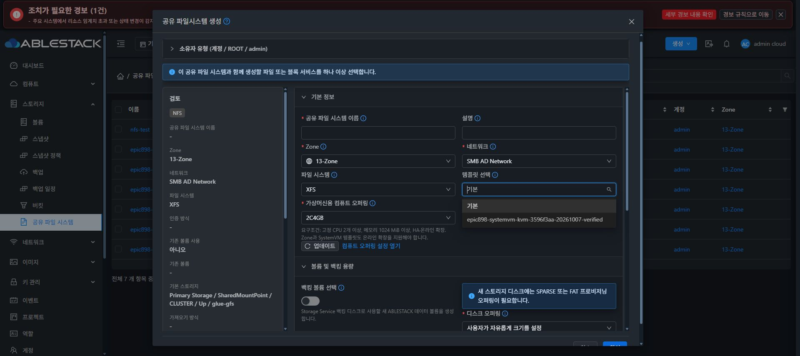
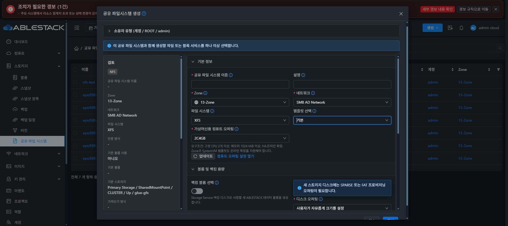

# Epic #898 SYSTEM 템플릿 선택 실제 UI 검증

소스 45c82e189dd5025198af03f93c283ad097c770e4의 생성 입력 기능을 정상 production UI 빌드 후 13번 클러스터에 적용했다. 29개 테스트 / 4 suites 및 lint 통과, 빌드 산출물 850개 파일을 immutable manifest와 비교했다.

- 실제 적용: 850개 static 파일의 SHA 일치, index SHA-256 2a6e969a8b23446553c17fabfc7211224156696c17bba4e02cfa78fc4454713f.
- 백업: /root/epic898-ui-backup-20261009-053819. config.json과 WEB-INF 전체 파일 및 관리 서버 PID 1189913 보존.
- Chrome에서 공유 파일 시스템 목록 → 생성 대화상자를 열었다. 템플릿 선택의 기본값, 준비된 기존 SYSTEM 템플릿 이름, 명시 선택 및 기본 항목으로 복귀를 확인했다.
- 실제 옵션 선택은 드롭다운의 보이는 .ant-select-item-option을 대상으로 수행했다. 접근성 보조 항목을 클릭한 초기 시도에서 값이 유지된 것은 성공으로 기록하지 않았다.
- 생성을 제출하지 않고 취소했다. 목록은 전후 7개이며 신규 VM·ROOT·DATA 생성은 0이다.
- 기존 원본 상세 화면에서도 Ready/XFS/100 GiB 정보와 조회 로딩 종료를 확인했다.

이 증거는 현재 템플릿 목록과 선택 컨트롤의 동작이다. 기존 템플릿의 보호된 최종 호환성 인수, 새 단일 소스 템플릿 등록 및 신규 공유 파일 시스템의 실제 생성 성공은 아직 검증하지 않았다. 최종 UI 표준 정리 #1275는 착수하지 않았다.

새 UI 적용 후 원래 상세 URL을 다시 reload해 정보 탭 Ready/XFS/100 GiB와 로딩 종료를 확인했다. 기존 THIN 볼륨을 읽기만 했으며 새 디스크를 생성하지 않았다.

