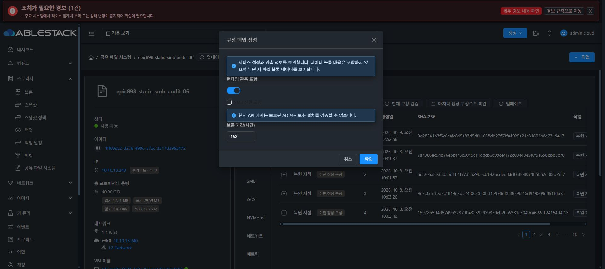

# Epic #898 신원 포함 백업 실제 UI 거부 검증

4e2aafc2e02083e0989888b4deda45610906a3f9의 신원 백업 입력 기능은 141개 테스트 / 10 suites, lint 및 정상 UI production build 850개 파일을 통과했다. 13번 static SHA 일치 적용, index SHA a8aad0f174e90d12f3fff98d701b9eede6892b54831e5338b0a570cceefa1be8, 백업 /root/epic898-ui-backup-20261009-065821, config·WEB-INF·관리 PID1189913 보존이다.

Chrome에서 VM50 백업·복원 → 구성 백업 생성 대화상자를 열었다. SMB 신원 포함 checkbox는 checked=false·disabled=true였으며 현재 API에서 보호된 유지보수 절차를 검증할 수 없다는 안내가 표시됐다. 일반 백업 확인 버튼은 활성 상태로 유지됐다. 확인을 누르지 않고 취소했고 마지막 정상 구성 리비전 48 표시를 유지했다.

이 결과는 실제 UI의 미지원 API 경계와 기본값 검증이다. 일반 백업 생성 성공 또는 암호화 신원 캡처·원본 권한 발급·복원을 수행한 증거가 아니다. 새 backend 및 native 계약을 함께 반영한 뒤 승인 positive·출력 descriptor·실제 API/UI 복원을 인수한다. 최종 UI #1275는 미착수다.

