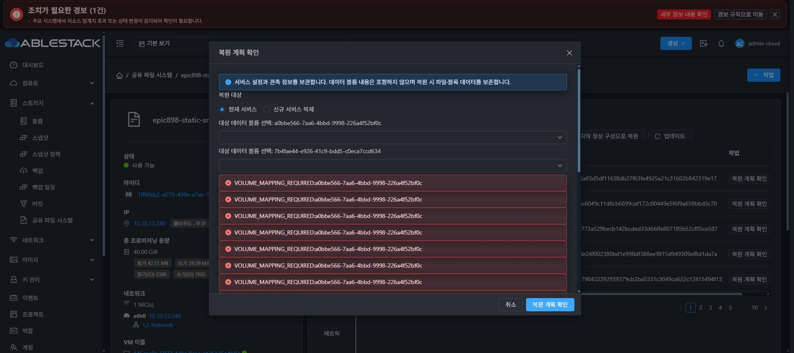

# Epic #898 복원 계획 실제 조회 UI 검증

21c0b67c69fe22af5df70456f4083802647abfe1의 복원 승인 기능 UI는 161개 테스트 / 11 suites·lint·정상 production build 850개 파일을 통과했다. 13번에 static SHA 일치 적용, index fcc41c80f379f5b7310b35a3ff99470ebfa4973f98e5c432560cf81d44921c18, 백업 /root/epic898-ui-backup-20261009-073919, config·WEB-INF·관리 PID1189913 보존이다.

Chrome의 VM50 백업·복원 탭에서 기존 마지막 정상 구성 리비전48의 복원 계획을 조회했다. 현재 서비스 계획은 두 DATA 볼륨의 명시 매핑을 요구했고, 생성0·변경0·유지23과 blocker가 표시됐다. 볼륨 매핑을 선택하거나 적용하지 않고 취소했다. 기존 LKG 리비전48을 유지했다.

이 결과는 기존 일반 계획의 실제 조회 회귀다. 구 ADE707 API는 새 AD 원본 authority/maintenance 계약을 아직 반환하지 않으므로 해당 승인 positive나 암호화 신원 복원 성공을 검증한 결과가 아니다. 실제 restore/AD 효과 0이며 새 backend·native를 함께 반영한 뒤 API/UI 및 외부 접속을 인수한다. 최종 UI #1275는 미착수다.

