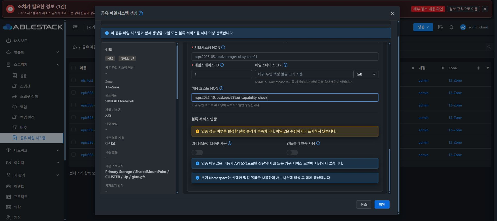

# Epic #898 NVMe 생성 인증 기능 실제 UI 검증

소스 d43ab7c12b9adbe3112d130d5016ecec10115405는 48개 테스트 / 5 suites, lint 및 정상 production UI 빌드 850개 파일을 통과했다.

13번 클러스터에 static 파일 850개를 적용하고 SHA 일치를 확인했다. index SHA-256은 e59074bb03a070155cea600cc493bcc683b5d1827d7bf32859d923bbb380a226, 백업은 /root/epic898-ui-backup-20261009-060000이다. config.json·WEB-INF 전체 파일 및 관리 PID 1189913을 보존했다.

Chrome에서 생성 → NVMe-oF 선택 → NVMe-oF 입력을 펼쳤다. 기본 템플릿의 지원 증거가 없을 때 미확인 안내를 표시하고 인증 스위치를 비활성으로 유지했다. 합성 host NQN을 입력한 뒤에도 host/controller 스위치 모두 비활성임을 실제 UI에서 확인했다. 비밀 입력이나 생성을 제출하지 않고 취소했고 전후 목록 7개를 보존했다.

이 증거는 지원 미확인 상태의 실제 입력 거부다. 새 템플릿의 예상 지원 선택·생성 후 exact instance의 fresh capability positive·정상 인증 flag 전송·Cloud 외부 인증/I/O 인수는 아직 남아 있다. unit의 positive를 실제 Cloud 성공으로 표시하지 않는다. CSS·테마·버튼·대화상자 배치 변경 0, 최종 UI 표준 #1275 착수 0이다.

