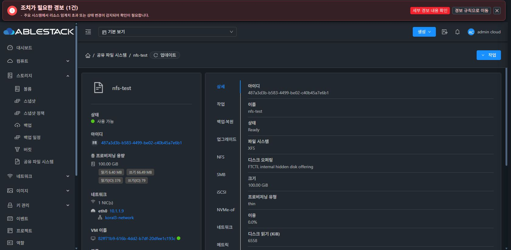

# 원래 상세 화면의 최신 POSIX UI 회귀

실제 static UI ca82d7cb9ced/850files/index59818461…/관리 PID1189913에서 Chrome의 원래 nfs-test 상세 직접 URL을 새로 확인했다. 상세 탭 selected, 상태 Ready/사용 가능·XFS·100GiB·기본 정보·활성 NFS 개요를 표시하고 loading에서 진전하지 않는 증상은 없다. 적용/생성/삭제·기존 DATA 변경0이다.

새 AD/API/ROOT 인수나#1275 최종 표준 레이아웃 완료로 확대하지 않는다. 실제 관리 서버는707 유지이고 해당 이슈의 merge/common gate는 남아 있다.
