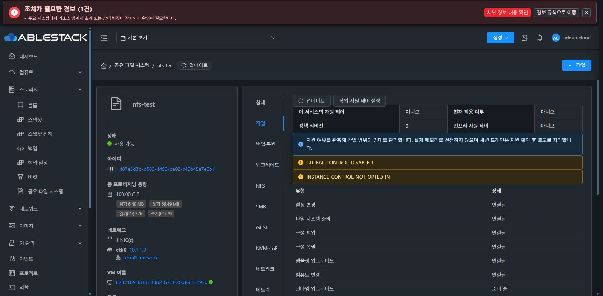

# 원래 상세 URL의 현재 배포 UI 회귀

2026-10-09 Chrome에서 기존 관리자 계정으로 정상 로그인하여 사용자 보고 URL
http://10.10.13.10:8080/client/#/sharedfs/487a3d3b-b583-4499-be02-c40b45a7e6b1?tab=details
로 직접 진입했다. 실제 로딩 종료와 nfs-test/Ready/XFS/100GiB/NFS 개요를 확인했다.

현재 조합은 관리 서버 namespace1dad+Volume1333 JAR e99a3ca3…/PID1171342와
기능 UI64be static index b89f501a…다. 새 source662 모듈이나 최종 template가
배포된 결과로 확대하지 않는다.

정보 탭에는 자원 정보와 서비스 개요가 표시된다. 실제 “작업” 탭을 클릭해
자원 제어 OFF/정책 rev0, 설정 변경 이력과 백킹 볼륨 준비 상태가 분리됨을
확인했다. 다시 상세로 돌아왔다. 설정 제출·정책 변경·서비스 작업은 0회다.
기존 THIN 데이터는 표시한 것이며 새 디스크를 THIN으로 만들지 않았다.

상세 기능 조회 회귀와 최종 UI 표준화는 다른 인수 단계다. #1275는 미착수이며
착수 전 전체 작업 중단·보고 후 추가 지시를 기다린다.
