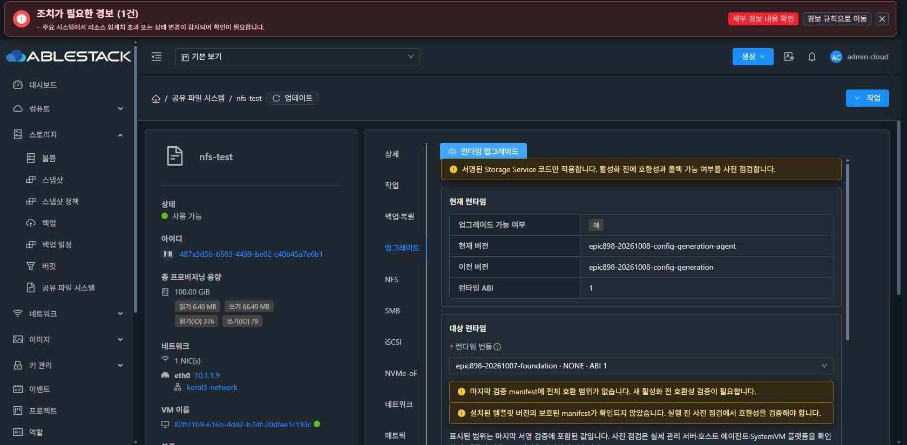

# 원래 SharedFS의 런타임 조회 UI

2026-10-09 현재 namespace1dad+Volume1333 관리 / UI64be 조합의 Chrome에서
원래 nfs-test 업그레이드 탭 → 런타임 업그레이드를 열었다. 응답 후
현재 epic898-20261008-config-generation-agent, 이전 config-generation,
ABI1과 COMPLETE100% 이력 7개가 표시됨을 확인했다.

마지막 서명 manifest의 전체 호환 범위와 설치 template의 보호 manifest가
미확인인 경고가 표시됐고, 실제 사전 점검 전 런타임 업그레이드 버튼은 비활성이다.
최초 조회 중 빈 값과 완료 응답의 값을 구분했다. 사전 점검/업그레이드/롤백을
누르지 않고 취소했으므로 런타임 변경 0회다. 새 strict source662와 template
인수 또는 fullFour 완료로 확대하지 않는다.

최종 UI #1275는 아직 시작하지 않았다.
