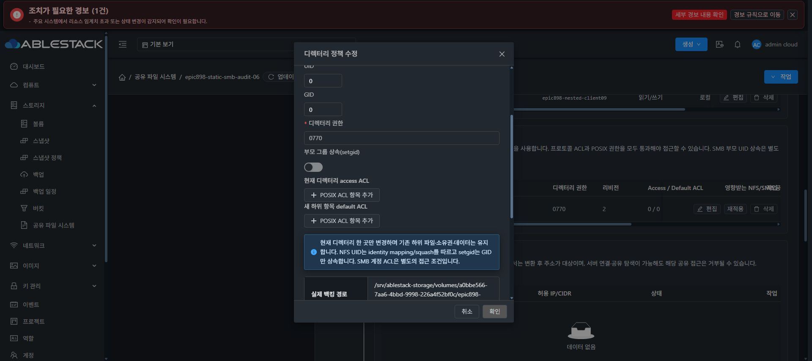

# POSIX 직접 변경 승인 UI 배포와 기존 정책 preview

ca82d7cb9cedd4546ece9f4733017f4fc0da4e7a의244 테스트/17 suites·lint·production PASS 결과를13번 static850개 파일로 배포했다. index SHA59818461fe7d9349afa133176a5184fd72b5f1e3cc9aa51ed23074f6a6cf8211이며 백업은 /root/epic898-ui-backup-20261009-093030이다. config/WEB-INF 전체 bytes·관리 PID1189913은 유지했다. Java825는 미배포이며 실제 서버707과 구분한다.

Chrome Cua에서 VM50 로컬 인증의 SMB 탭에 진입했다. 생성 입력을 열어 기존 canonical 경로의 영향 확인을 요청하면 기존 공통 정책을 편집해야 한다는 오류와 비활성 확인을 표시했다. 취소 뒤 기존 정책 편집을 새로 열어 readonly preview를 요청하니 현재/예상0:0·0770, 실제 백킹 경로·파일 시스템 UUID와 영향받는 NFS 공유가 표시됐다. 기존 ACL/소유권 동의 checkbox는 미체크이고 확인은 비활성이다. 적용 없이 취소하고 visible dialog0을 확인했다.

API 재조회에서 정책56cee470-44ba-486e-a6fb-f3ba71498389는 리비전2/inode33685632/UID:GID0:0/mode0770/FS a4337197-eab7-4e86-bd4a-a7b4ffd64adf를 유지한다. 생성·갱신·적용·삭제 제출0이다. preview는 실제 readonly API 호출이고 source-only 테스트로 대신하지 않았다. 실제 JOINED 승인 후 변경 인수는 새 시험 서비스에서 남아 있다. 최종 UI#1275 레이아웃·스타일 정리와11탭 QA는 미착수다.

배포/정책/API/UI proof: /root/work/epic898-preparation/ui-posix-ca82-deployment/{deployment,ui-proof,posix-policy-public-read}.json.
