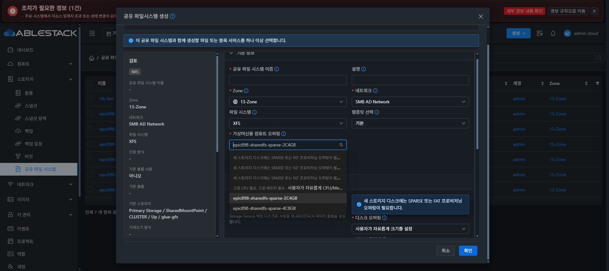

# Epic #898 ROOT SPARSE 선택 실제 UI 검증

6190a3dfbbd67d170f9a6630fb23035e48cc6b44의 Create 전용 ROOT 오퍼링 제한은 150개 테스트 / 10 suites, lint 및 정상 UI production build 850개 파일을 통과했다.

13번에 static SHA 일치로 적용했다. index SHA 01f36241c976986f95ed1602b08aa614330b05b356366402ed8a6aefbddec0ea, 백업 /root/epic898-ui-backup-20261009-071653이며 config·WEB-INF·관리 PID1189913을 보존했다.

Chrome 생성 대화상자에서 epic898-sharedfs-sparse-2C4GB가 기본 선택됐다. 실제 API가 THIN으로 반환한 2C4GB와 다른 THIN 항목은 disabled 클래스와 SPARSE/FAT 필요 안내를 표시했다. SPARSE 4C8GB는 선택 가능한 상태였다. 새 VM·디스크 생성은 제출하지 않았다. Escape가 드롭다운과 대화상자를 종료한 뒤 dialog 0·기존 목록 7개를 확인했다.

이 결과는 실제 선택/default/THIN 거부 UI 검증이다. 새 템플릿으로 정상 생성·물리 ROOT/DATA SPARSE 확인은 후속 테스트에 남았다. 공통 scale constraint와 기존 THIN ROOT는 변경하지 않았고 최종 UI #1275는 미착수다.

