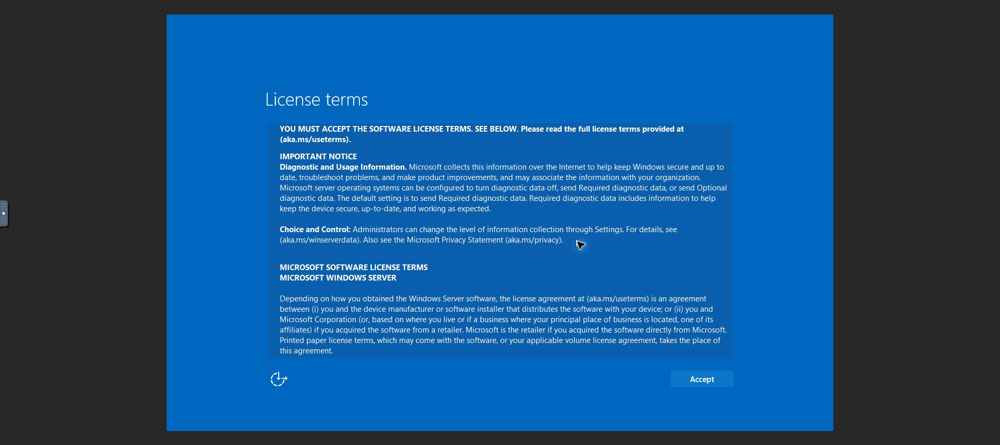

# SMB-Client OOBE 화면 재연결

2026-10-09 09:20KST QGA 읽기 전용 조회에서 SMB-Client i-2-47-VM은 OOBEInProgress1/SetupPhase4/msoobe 실행, WORKGROUP·domain 미가입이다. Sysprep로 생성한 새 SID/GUID와 기존 ROOT UUID를 보존했다. DNS/hostname/join·registry·unattend 변경0이다.

Chrome에서 기존 Mold UI 재로그인 후 SMB-Client의 콘솔 버튼으로 정상 noVNC를 재연결했다. 검은 화면에서 Shift만 보내 절전 화면을 깨운 뒤 Windows License terms 화면이 실제 표시됐다. Accept와 새 Administrator 암호 입력/제출은 실행0이다. 약관·새 인증 정보는 기존 사용자 인계 상태를 유지한다. 콘솔 URL의 토큰은 문서/이미지/로그에 기록하지 않았다.

source AD 또는 ROOT 테스트를 Windows 완료로 확대하지 않는다. 다른 기능 구현·검증은 계속하며 최종 UI#1275는 미착수이다.
