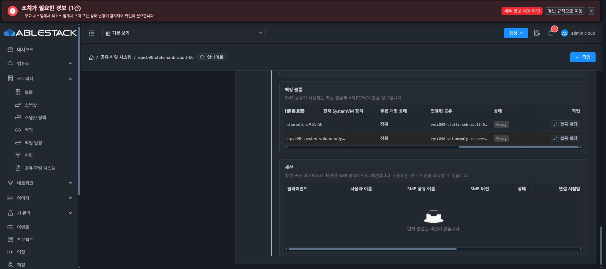

# SMB 백킹 볼륨 연결 공유 집계 UI 반영

소스 64be87e3112da6c7df58b2105e9217b42c23c9b9에서 SMB 백킹 볼륨 행에 첫 공유 이름만 표시하던
기능 정보 누락을 수정했다. UUID별 용량 행은 하나로 유지하면서 해당 볼륨에 연결된
공유 이름을 중복 없이 모두 집계한다. 템플릿/CSS/탭/대화상자 배치는 바꾸지 않았다.

focused 신규2 tests PASS, 나머지29 tests는 이 focused 실행에서 수행하지 않았다.
lint PASS, immutable source Git archive의 production module build가 완료됐고
검증한 두 소스 파일 SHA가 전후 같았다.

13번에 static 844 files를 반영했다.
index SHA b89f501a3a4a9b16c4d84b035e59545d14eebb89d8c6d36722740ce928578243, 백업 /root/epic898-ui-backup-20261009-003034이다.
config.json / WEB-INF / 관리 서버 PID를 보존했고 모든 static hash가 일치했다.

Chrome에서 같은 SharedFS를 새 UI로 reload했다. SMB 백킹 볼륨2행과 각각20.0 GiB,
새7b4 SPARSE / xfs / /dev/sdc / 정확 / Ready를 확인했다.
새 볼륨의 연결된 공유 전체 UI 텍스트는
epic898-volumeonly-ss-parent10, epic898-volumeonly-ss-child10 이다.
기존 a0b 행도 연결된 다섯 공유 이름을 집계한다.
현재 열 너비에 따른 생략 표시는 기존 방식이며 전체 텍스트는 렌더된 UI의
접근성/DOM 읽기 관찰로 확인했다. 추가 API 변경·이동·포맷은0이다.

최종 UI 표준화 #1275는 착수하지 않았다. 모든 선행 기능의 실제 인수 뒤 착수 직전에
전체 작업을 중단·보고하고 추가 지시를 기다리는 조건을 유지한다.
