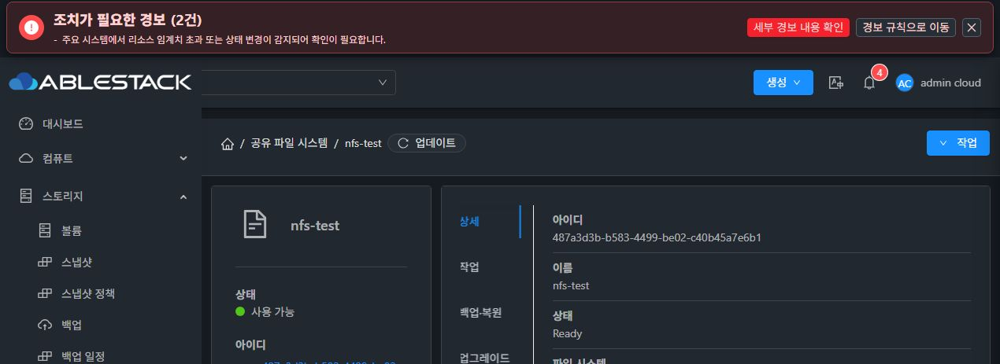
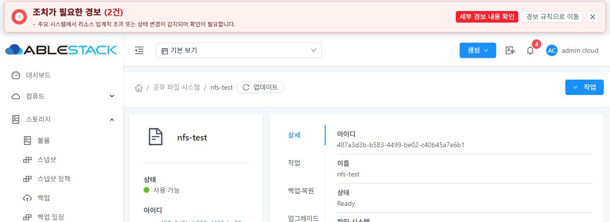
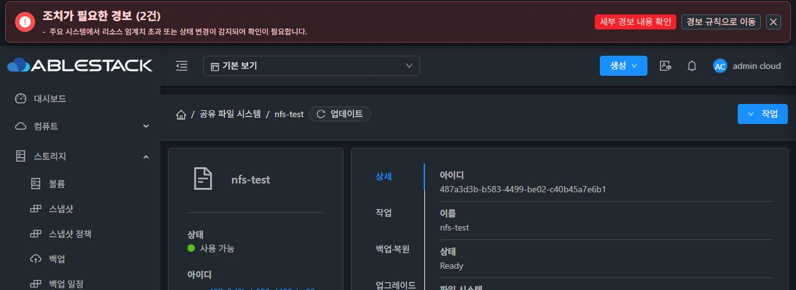

# #1269 dc1453 실제 Chrome 읽기 기능 검증

2026-10-10 04:49–04:57 KST, 새 자기 Chrome 탭 1588257759에서 원래 nfs-test / 487a3d3b-b583-4499-be02-c40b45a7e6b1만 조작했다. Native F1 탭 1588257748은 바인딩·조작하지 않았다. 첫 단계는 기존 로그인 세션을 재사용했다. 이후 부모가 Native UI idle과 cookie 갱신을 승인한 뒤 자기 새 탭에서 정상 logout→admin login을 각1회 수행했고, 원래 상세를 재확인했다. credential은 UI 런타임에만 입력하고 저장하지 않았다. 화면에서 실제 Ready/사용 가능·XFS·100.00 GiB·기존 thin·NFS 개요가 유지됐다. 신규 THIN/VM/볼륨/계정/서비스 변경은0이다.

## 실제 확인 범위

| 시나리오 | 관측 | 정확한 한계 |
| --- | --- | --- |
| 기존 로그인·새 자기 탭 direct Details | 필드/개요가 표시되고 정상 조회가 종료됐다. Root가 배포한 앱/SharedFS chunk를 실제 DOM script src에서 확인했다. | 첫 새 탭은 기존 인증을 재사용했다. 후속 승인된 logout/login1회로 새 인증 gate를 따로 확인했다. |
| 목록→원래 nfs-test 상세 | 목록의 nfs-test 링크만 클릭, 원래 UUID/Ready/100 GiB를 유지했다. | 다른 SharedFS 행 제어0이다. |
| reload 직후 NFS↔Details 빠른 왕복 | 약3.6초 뒤 Details/Ready/100 GiB 유지, 무한 spinner가 보이지 않았다. | 첫 시도는 클릭 전 spinner0이라 초기 in-flight를 단정하지 않았다. 후속 새 인증 direct에서 실제 visible spinner1을 관측하고 NFS↔Details를 즉시 왕복한 뒤 spinner0/NFS 개요·기본 필드를 확인했다. 구체 요청 endpoint/count는 관찰하지 않았다. |
| 연속 업데이트 버튼 조회 | double-click 후 정보·Ready를 유지하고 정상 화면으로 돌아왔다. | network request count를 읽지 않았으며 actual coalescing을 UI만으로 입증하지 않았다. 기존 source 회귀의 coalescing PASS와 별도다. |
| 라이트/다크 정상 필드 가독성 | 양 모드에서 Ready/기본 필드를 읽고 정상 완료 화면을 캡처했다. 라이트에서 정상 업데이트도 수행했다. | 원래 dark-mode/checked dark로 복원했다. style/theme 코드나 배치는 편집하지 않았다. |
| 마지막 상태 | Details/Ready/100 GiB, dark 원복, visibleSpinners0, 자기 탭만 종료 | 실제 guest 서비스/I/O 전체 성공을 의미하지 않는다. |

자연 발생한 partial 조회 실패가 없어 TIMEOUT/TRANSPORT/READ_FAILURE 안내·이전 값 유지·오류 후 수동 재시도의 **실제 UI gate는 미확인**이다. 화면 상단의 일반 인프라 경보2건은 partial read 오류로 세지 않았다. fault injection·network interception·hidden Vue·page internal API·QGA/프로토콜 정지·서비스/VM/DATA 작업은0이다. unit366/21/synthetic alert 렌더를 이 실제 gate의 성공으로 바꾸지 않는다.

## 실제 source 연결

배포 dc1453 / index e75592ad… / config d3e symlink / JAR15f361·PID1331803 보존의 부모 proof와 HTTP200·exactbytes/SHA 10파일 served proof를 재사용했다. 자기 페이지의 DOM src `js/app.8fa0f943.js`, `js/chunk-7d2a7a2f.149155ef.js`가 그 공개 served proof와 일치한다. source marker를 숨은 Vue state나 직접 API 호출로 만들지 않았다. 무관한 browser tab/console token은 증거에 저장하지 않았다.

## 캡처

현재 viewport는 기본 브라우저 크기를 그대로 사용했다. 캡처는 보이는 정상 필드와 화면 문맥을 보여주며, 아래쪽 전체 필드/개요는 같은 시각의 public DOM text와 함께 판정한다. 반응형·버튼 정렬·11탭 최종 표준 QA를 수행한 것이 아니다.

## 새 인증과 초기 spinner 보충

부모의 추가 GO 뒤 정상 logout→기존 admin login1회, 원래 directDetails를 수행했다. 로그인 화면 값은 redacted 상태였으며 입력값·cookie/token을 증거에 저장하지 않았다. visible spinner1 → 즉시 NFS/Details 왕복 → Ready/XFS/100GiB/활성NFS·spinner0을 확인했다. dark-mode를 유지했고 자기 두 번째 탭도 종료했다. 이 시간 관측을 구체 readonly API request count나 특정 endpoint 처리 시간으로 바꾸지 않는다.

## 현재 판단

P0 원래 경로의 기존/새 인증·direct/목록/reload·초기 spinner 왕복·양 모드 정상 조회 subset을 확인했다. 실제 request count/coalescing과 자연 partial 오류 UI gate는 미확인이다. #1269 전체 close를 새로 판단하지 않고 남은 exact gate로 유지한다. #1275 최종 작업 미착수·시작 직전 전체 STOP 조건은 그대로다. 취소된 Kubernetes 요청은 제외한다. 스킬 computer-use 및 CUA의 supported DOM/locator/screenshot만 사용했고 실제 작업은 읽기/일시 테마 전환 및 원복이다. 소스/Build/Git/GH/Native guest 효과0이다.

공개 proof는 p0-ui-public-proof.json이며 이벤트·script path·기존 정보·한계·theme 원복·스크린샷 SHA를 담았다. Windows 원본 위치는 C:/Users/ablecloud/.codex/artifacts/epic898-p0-dc1453 이고 준비 영역으로만 복사했다.
