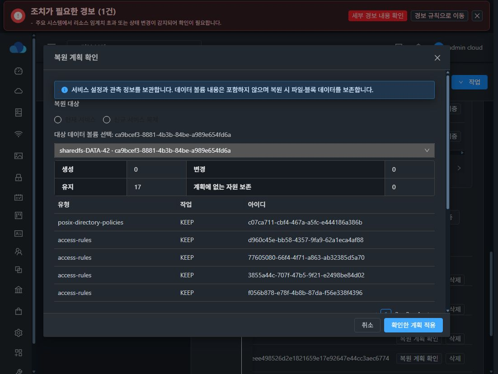
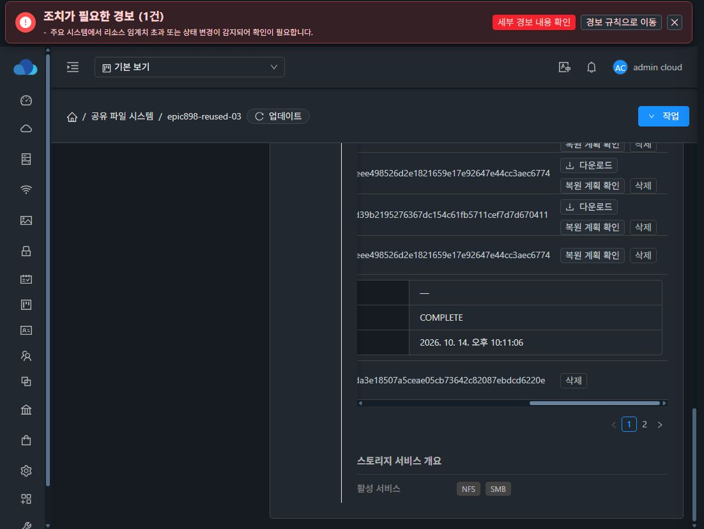
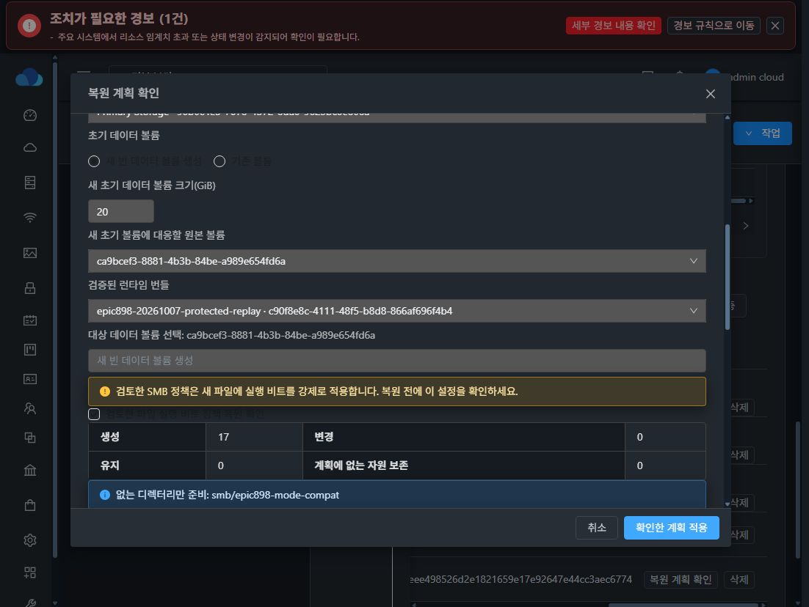

# Epic #898 구성 백업·복원 중간 API 및 실제 UI 검증

backend 구현은 10a0f14bf00, UI production은 e6ecf91e509를 사용했습니다. 13번 작업용 SharedFS에서 검증했습니다. 이 기록은 전체 #909 완료를 뜻하지 않습니다.

- 실제 baseline 검증으로 revision 30 ACTIVE_LKG/VERIFIED_SUCCESS를 생성했습니다.
- COMPLETE 백업을 일회성 token으로 다운로드하고 ZIP와 SHA-256을 검증했습니다. 재업로드 candidate c97360d2-9cc5-4eb1-935d-74c748803a44가 ARCHIVE_VALIDATED로 확인됐습니다.
- 실제 DB lifecycle 컬럼 updated/removed 때문에 첫 가져오기 검증이 거부됐습니다. 공개 exporter에서 해당 관리 컬럼을 제외하고 회귀 테스트 14개를 통과한 뒤 실제 재전송을 검증했습니다.
- 실제 UI에서 구성 백업 생성 dialog, 확인 즉시 닫힘, 진행 banner 및 완료 row를 확인했습니다.
- 실제 UI의 대상 volume dropdown을 명시적으로 선택한 계획은 생성/변경/삭제 0, 유지 17, blocker 0이며 SMB 재입력 4개와 이름 확인을 표시했습니다.
- 적용은 기존 credential을 메모리에서만 재입력하는 API로 검증했습니다. job f2a68991-bda7-4ec1-9753-cd986dac48ed가 성공했고 UI expanded row에서도 restoreState COMPLETE를 확인했습니다.
- 기존 파일 SHA-256 91bacf71842433d7e5da986aad4b0d115161fc3fc033d998bc76c99759e53a78, UID/GID 1002:1002, mode 0775, inode 16777354 및 Samba 계정 수 2가 유지됐습니다. 실제 기존 SMB 클라이언트 인증도 성공했습니다.
- 매핑 없는 계획은 blocker와 token 미발급으로 차단됐고 그 적용 job은 431로 실패했습니다.

## 실제 UI 증빙

## 남은 검증과 UI 정리

변경·생성 계획의 실제 적용과 실패 rollback, 신규 서비스 복제, LKG 복원, 재시작/수명주기/권한 및 모든 프로토콜 통합 게이트는 남아 있습니다. 실제 화면은 현재 legacy 상세 레이아웃이며 표의 가로 스크롤과 다크모드 비활성 항목 가독성 문제가 있습니다. 위 화면을 최종 UI 완료 증빙으로 사용하지 않습니다. 모든 기능 뒤 #1275에서 VM 표준 세로 탭·왼쪽 action group·fixed dialog header/footer 및 content scroll로 정리합니다. SMB AD만 사용자 요청대로 보류합니다.

## 추가 실제 UI 계획 검증

새 계획 UI(0ffe production)에서 신규 복제 resource picker로 zone/network/compute/disk/pool/초기 source volume/검증 runtime을 명시적으로 선택했습니다. 추가 VM을 생성하지 않고 계획만 검증했습니다. force mode 0775 정책 확인이 없으면 blocker를 표시하며, checkbox 확인 후 계획을 재발급하면 blocker가 제거되고 재입력/이름 확인 단계로 바뀌었습니다. 없는 디렉터리만 준비하는 상대 경로 목록도 표시됩니다. darkmode의 비활성 control 가독성은 #1275에서 보완해야 합니다.

실제 clone 실행은 테스트용 별도 API 계획으로 검증 중이며 NFS 최종 desired/runtime 관측에서 차단된 상태입니다. UI 계획 성공을 clone 실행 성공으로 사용하지 않습니다.
