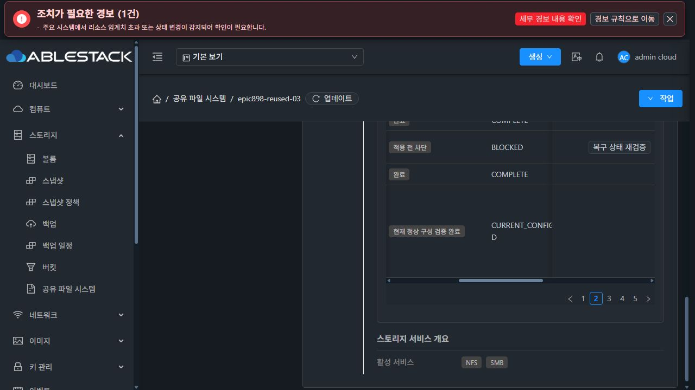

# Epic #898 실패 작업 재검증 실증 (2026-10-07)

## 범위와 결과

#892의 과거 실패 이력을 최신 정상 구성으로 재검증하는 경로를 13번 테스트 클러스터에서 API와 실제 Mold UI로 검증했다.
이 결과는 #892의 전체 완료를 의미하지 않는다. 런타임 generation, 인증 상태의 원자적 복구와 재시작 재개 등 남은 완료 조건은 계속 진행한다.

- 구현: `082ef818f26e027533778cd3ff8cecc91933e7b6`
- 실제 JSON 숫자 비교 보완: `451f44dcb58b2886e8ea0b48ea20ad8b0b38dd21`
- 테스트 서비스: `epic898-reused-03`, SharedFS `25b7fbd0-9cc7-4951-a217-aa63962a7987`
- 원래 실패 작업: `c40d5360-5819-48c1-a8c5-226e263c605e`, revision `16`
- 유지한 최신 정상 구성: revision `28`
- 원래 진단과 revision을 유지하면서 `RECOVERY_REQUIRED → RECONCILED_SUPERSEDED`, 단계 `CURRENT_CONFIG_VERIFIED`, 진행률 `100`을 API와 실제 UI에서 확인했다.
- 이전 DB snapshot을 재적용하지 않았다. 현재 NFS/SMB 공유, 공통 POSIX 정책과 볼륨 연결을 유지했다.

## 실제 UI 검증

상세 탭의 설정 변경 작업 이력에서 원래 실패 행을 선택했다.
대화상자의 작업 UUID와 기존 진단, 이후 정상 revision 보존 안내를 확인하고 확인 버튼을 눌렀다.
요청이 접수되면 대화상자가 닫히고 진행 안내가 나타났으며, 완료 후 해당 행에 현재 정상 구성 검증 완료가 표시됐다.

현재 상세 표의 너비와 고정 컬럼에 따른 겹침은 #1275 최종 UI 정리 대상이다. 이 이미지는 기능 결과의 증빙이며 최종 레이아웃 완료 증빙은 아니다.

## 비교 오류 발견과 회귀 검증

첫 실제 UI 시도는 NFS ACL 불일치로 차단됐다. 실제 설정의 클라이언트 CIDR, 권한, squash 및 anonymous UID/GID는 동일했다.
Gson에서 정수로 생성한 JSON 값과 문자열에서 파싱한 JSON 값은 같다고 비교되지만 hashCode가 달랐다.
HashSet으로 비교하면 정상 값도 불일치로 분류되므로 구조적 값과 개수를 직접 비교하도록 수정했다.
파싱한 실제 JSON 숫자에 대한 일치 검증과 UID 변경 시 차단 검증을 추가했다.

- 복구 기반 모듈: 35개 테스트 통과
- 숫자 비교 및 관리자 관측 보완: 11개 테스트 통과
- SystemVM Storage Service 회귀: 38개 테스트 통과
- UI lint 통과, 이력·SharedFS·locale 3개 suite / 32개 테스트 통과
- 운영 UI 빌드 및 배포: 841개 정적 파일 hash 일치, 관리 서버 config와 WEB-INF 유지
- 단일 클래스 보완 배포: 나머지 jar entry의 바이트 보존 확인
- 기존 두 서비스와 전용 테스트 서비스 모두 Ready / Running 확인

## 데이터 보존 검증

실행 전후 다음 값과 실제 결과 전체가 일치했다.

| 대상 | 실행 전후 결과 |
| --- | --- |
| 공통 디렉터리 | UID/GID `1001001:1001001`, mode `2775`, inode `16777353` |
| 기존 테스트 파일 | UID/GID `1002:1002`, mode `0775`, inode `16777354` |
| 파일 SHA-256 | `91bacf71842433d7e5da986aad4b0d115161fc3fc033d998bc76c99759e53a78` |
| POSIX ACL | access/default ACL 전체 일치 |
| SMB 로컬 인증 계정 | 기존 두 계정과 UID 유지 |
| 데이터 볼륨 파일 시스템 | XFS UUID `cd2a29fc-befe-41d7-bb47-34468acd7ec3`, 정확한 mapping 유지 |

비밀번호, API/SSH 인증정보 또는 서명 개인키는 문서·저장소·증빙 파일에 포함하지 않았다.
