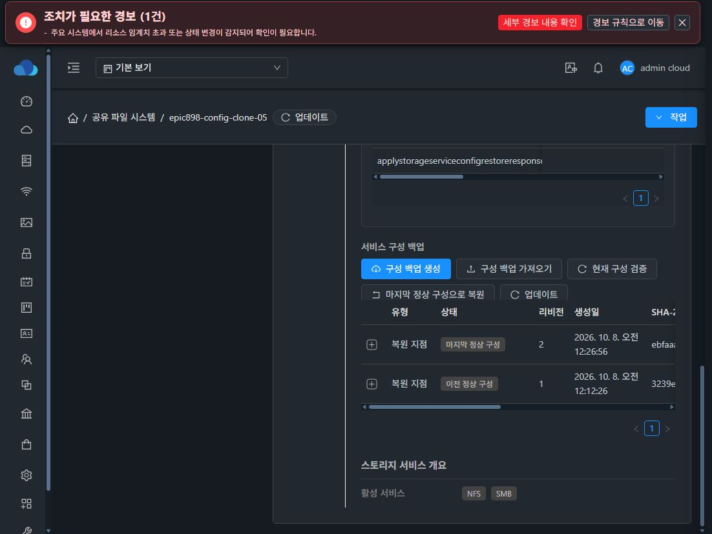
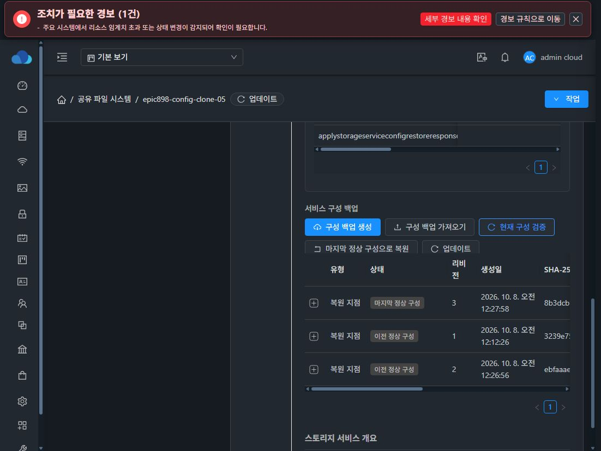
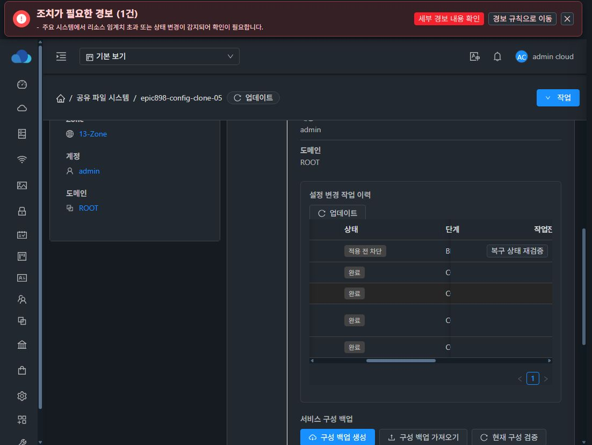

# 마지막 정상 구성의 단일 활성 제약과 revision 비교

cloud.storage_service_config_artifact.active_lkg_instance_id는 RESTORE_POINT/ACTIVE_LKG/removed IS NULL인 행에만 instance_id를 반환하는 STORED generated bigint 컬럼입니다. uk_storage_service_config_artifact__active_lkg unique index로 같은 서비스에서 두 지점이 동시에 활성화되는 것을 DB가 거절합니다. 다른 artifact 및 만료 이력은 NULL이므로 기존 보존 방식을 유지합니다.

승격은 CANDIDATE 행과 현재 활성 행을 잠근 트랜잭션에서 수행합니다. runtime 검증 전에 읽은 활성 ID·revision이 현재 값과 동일하고, candidate revision이 현재보다 큰 경우에만 이전 지점을 SUPERSEDED로 바꾸고 새 지점을 ACTIVE_LKG로 승격합니다. 충돌·실패 시 이전 활성 지점을 유지하고 candidate를 FAILED로 기록합니다.

신규 schema 두 경로와 기존 개발 DB의 idempotent ALTER 경로를 반영했습니다. 기존 활성 중복이 있으면 ALTER를 실패시켜 검증 없는 임의 삭제를 막습니다.

검증:
- 모듈 package 성공, DAO revision 회귀 3개 및 읽기 범위·stale source·원자적 변경 회귀 13개 통과.
- 13번 관리 서버 DB의 임시 테이블에서 중복 활성 UPDATE 거절, promotion rollback 후 기존 ID 유지, superseded source 재활성화 거절 확인.
- 실제 13번 DB 제약 적용 완료. 기존 3개 서비스의 활성 지점을 유지했습니다.
- 실제 LKG 복원 9e3048d3-36f7-4f5e-a35e-7035bac27cca 성공, 활성 지점은 하나이며 59fe7b6b-1b36-4549-b55d-4d68bd071e45 revision 1은 SUPERSEDED, fb5f8b74-92d3-4c8d-b054-d0d3b070125c revision 2는 ACTIVE_LKG로 승격됐습니다.
- 복원 전후 VM boot ID, Samba PID, DATA filesystem UUID, 파일 SHA-256·UID/GID·mode·inode의 출력이 정확히 일치했습니다.
- 실제 UI의 설정 변경 이력 COMPLETE, 마지막 정상 구성 revision 2, 이전 정상 구성 revision 1 보존을 확인했습니다.

이 검증은 DB 단일 활성 제약과 성공 복원 범위입니다. 관리 서버 재시작·프로토콜 장애 주입·전체 구성 복구 조건은 별도 검증합니다.

UI에서 현재 구성 검증을 실행해 revision 3 승격과 이전 지점 보존을 확인했습니다.

잘못된 확인 이름, 토큰, 필수 자격증명 누락, superseded LKG 참조의 실제 비동기 작업 실패와 활성 LKG 보존을 확인했습니다. 정상 계획 생성 후 별도 검증으로 revision 3 → 4가 된 뒤 오래된 계획의 적용도 2adf450d-e8de-4585-b916-a378fb320da8에서 BLOCKED로 차단됐습니다. UI에 적용 전 차단과 새 dry-run이 필요하다는 진단을 표시하며 revision 4 지점을 유지합니다.

추가 구현: 작업의 COMPLETE/result/phase와 LKG 승격을 같은 DB 트랜잭션에서 커밋합니다. candidate artifact 파일은 앞서 기록하며 트랜잭션 실패 시 제거하고 FAILED로 기록합니다. rollback 이후 in-memory operation도 COMPLETE로 남지 않습니다. 관련 모듈 회귀 18개가 통과했습니다. 실제 DB 임시 테이블에서 operation 완료 기록에 실패를 주입했을 때 LKG·operation을 함께 rollback하고 성공 시 함께 commit하는 것도 확인했습니다. 배포 후 실제 시험 서비스 실패 주입 검증은 별도 기록합니다.
