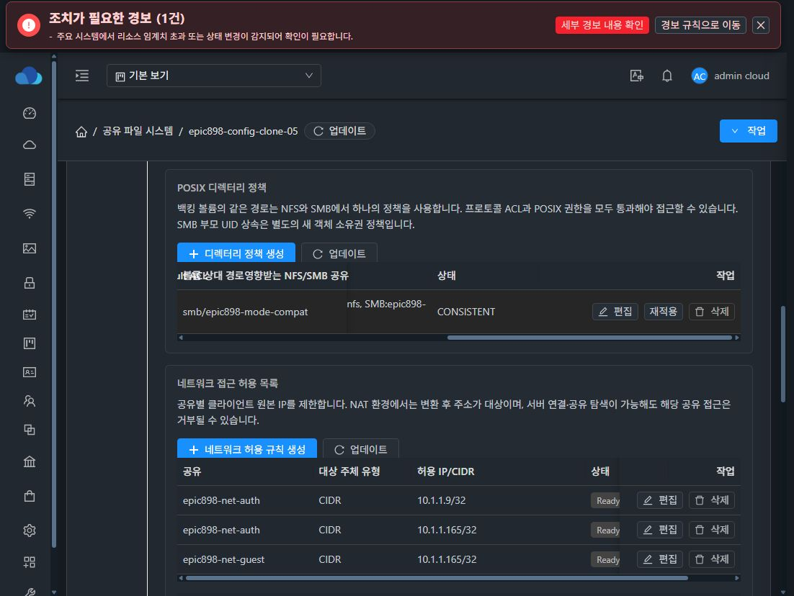

# 신규 복제의 최초 SMB 인증과 공통 POSIX 정책 검증

- 구현 소스: bd3513c5921386a9038bce0f87d54ef2fb5bcdcf
- 관리 서버: 10.10.13.10, native runtime: epic898-20261008-smb-initial-identity
- 대상 SharedFS: 65260ea9-bdb1-4ce4-bd6e-55cd755b5c59
- CREATE_NEW 작업: 97485dc6-c69f-4bac-a232-7595615684cc, SUCCESS
- 신규 VM: fb6342f3-df51-41ef-89cb-4099ab466f69, 신규 DATA: 12f44813-96a4-4b15-a9c1-ac7928403e6e

최초 local machine identity가 바뀌면 Samba daemon을 갱신합니다. 같은 identity에서의 일반 정책 변경은 기존 reload를 유지합니다. 새 VM을 재부팅하지 않고 기존 시험 계정으로 SMB 인증과 쓰기가 성공했습니다.

파일 epic898-initial-auth-proof.txt의 UID/GID는 1001001:1001001, mode는 0775입니다. SMB 쓰기 후 NFS 클라이언트가 읽은 SHA-256도 bb4a726771dac07790d3ad29f65bc839b73bfdef5ab5df842edb827bf6c031d0으로 일치했습니다. 구성 복제에는 원본 파일 데이터가 포함되지 않습니다.

실제 UI에서 SMB 공유 세 개와 ACL 네 개의 Ready 상태, NFS와 SMB의 같은 경로를 사용하는 POSIX 정책 CONSISTENT, 네트워크 접근 규칙 CONSISTENT, DATA 장치 매핑 정확 상태를 확인했습니다. 아래 화면은 넓게 보기에서 정책 테이블을 가로 스크롤한 실제 화면입니다.

현재 표의 가로 스크롤과 버튼·탭 배치는 최종 UI 정리 #1275에서 개선할 대상입니다. 이 검증은 신규 복제의 최초 인증과 파일 접근 범위입니다. #909 전체 실패 복구, 전체 프로토콜, 재시작 및 artifact 수명주기의 완료 증거로 사용하지 않습니다.
