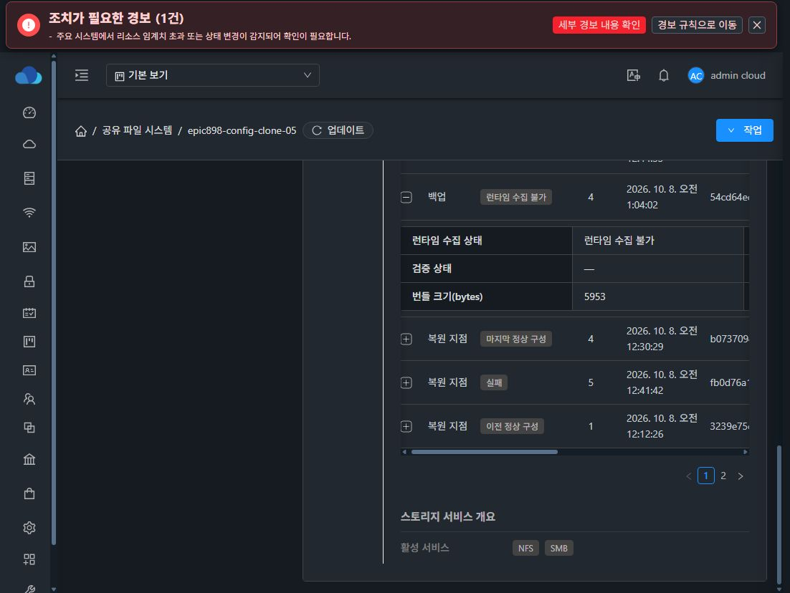

# 구성 백업의 중지 상태·UI 다운로드·접근 제어 검증

소스 cc369a92c93f5ae74c7846303ed12d713029bbdf를 모듈 빌드해 관리 서버와 UI에 배포했습니다. 서버 회귀 8개, UI 회귀 18개, lint와 production build가 통과했습니다. UI 파일 841개의 해시를 확인했고 config.json, WEB-INF, 관리 서버 PID를 보존했습니다.

중지된 신규 시험 VM에서 실제 UI의 백업 생성·확인을 실행했습니다. 백업 6ce2d86d-df38-4e1c-9339-c3582515a712는 revision 4, PARTIAL이며 runtimeStatus는 UNAVAILABLE입니다. inventory/health/sessions의 개별 관측도 success=false/UNAVAILABLE로 기록했습니다. UI에는 런타임 수집 불가를 명확히 표시합니다.

내장 브라우저는 다운로드 시작 후 canceled를 반환했고 파일 저장 허용 설정과 다운로드 관리자 접근을 도구가 지원하지 않았습니다. 사용자가 선택한 Chrome에서 실제 다운로드 버튼을 실행해 5953바이트 수신을 확인했습니다. 사용자가 저장 완료를 확인한 뒤 실제 Downloads 폴더의 ZIP을 검사했습니다. 크기는 5953바이트, SHA-256은 54cd64ed78fc71d10a6a741e9d362e26412e4865374cee681858787d0240215c로 서버 백업과 일치했고 ZIP 무결성이 통과했습니다. 세 runtime JSON의 UNAVAILABLE 상태도 파일에서 확인했습니다. 실제 저장 확인에는 사용자 개입이 있었음을 기록합니다.

일회성 다운로드 토큰은 첫 사용 후 재사용이 거절됐고 65초 대기 후 60초 만료 거절도 확인했습니다. 토큰은 메모리에만 사용했습니다.

일반 사용자 시험 계정으로 구성 API 15개를 검증했습니다. 다른 서비스의 metadata 조회 4개는 범위 권한으로 거절했고, 변경·검증·계획·전송·삭제 11개는 관리자 역할 제한으로 거절했습니다. 시험 계정은 비활성화했고 사용자 자원과 자격증명 파일을 생성하지 않았습니다.

시험 VM은 실제 UI 시작·확인으로 재기동했습니다. VM/템플릿/호스트/IP와 LKG revision 4를 유지했습니다. boot ID는 바뀌었으며 파일 SHA-256·UID/GID 1001001:1001001·mode 0775·inode·filesystem UUID는 유지됐고 SMB 인증과 파일 읽기도 성공했습니다. 이 검증은 구성 전송·권한·성공 재기동 범위이며 전체 #909 완료 증거로 사용하지 않습니다.
