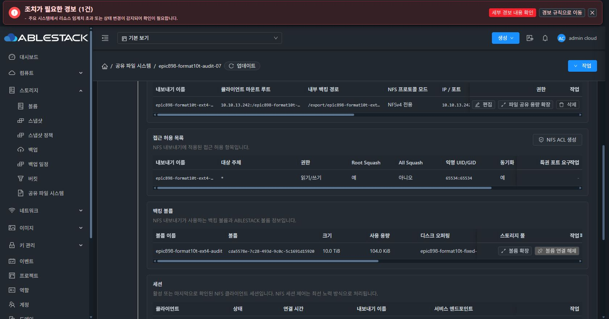
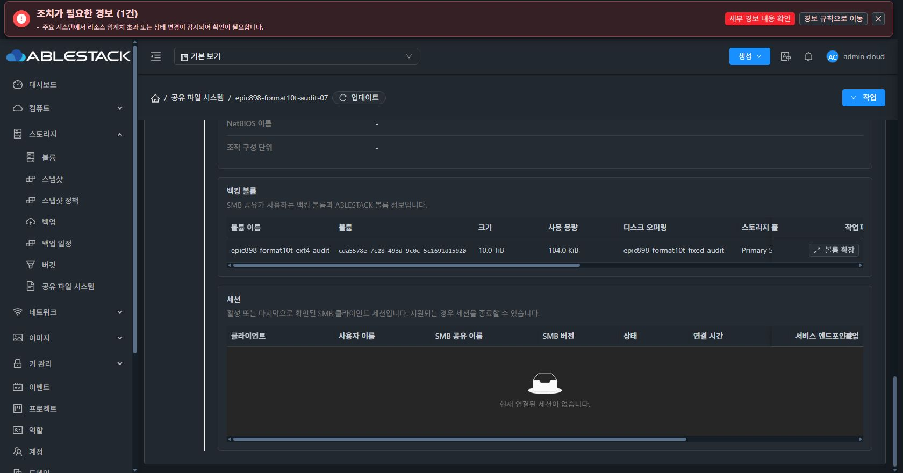

# 숨김 백킹 볼륨의 실제 API/UI 검증

10TiB XFS/EXT4 검증 중 displayvolume=false인 전용 볼륨이 API의 기본 display=true 조건에 걸려 공유 파일 시스템 백킹 표에서 누락되는 결함을 확인했다. 같은 UUID의 listVolumes 기본 조회는 빈 배열이며, root-admin의 displayvolume=false 조회는 실제 10TiB/DATADISK/Ready/VM UUID를 반환했다.

48371b95df16fdbebc405423dd7f4f6ee789c91a는 현재 서비스에 알려진 정확한 backing UUID 또는 VM UUID 범위에서만 숨김 조회를 보완한다. 일반 사용자에게 root-only 플래그를 전달하지 않고, 서비스 범위 없는 목록을 거부한다. VM 범위에서는 visible/hidden을 함께 합치며 최종 backing 목록은 UUID로 중복 제거한다. 26개 UI 테스트와 lint가 통과했다.

현재 배포는 a16a88d42cd744925f9b2164dfa6037cca28f78b의 UI에 검토된 backing 조회 함수와 fe69 ROOT identity 표시를 선택 적용한 모듈 빌드다. 아직 backend 권한 preview가 완성되지 않은 NFS 추천 UI는 이번 배포에 포함하지 않았다. 전체 source가 같은 최종 UI는 기능 인수 완료 후 정리 단계에서 빌드한다.

Production 빌드 후 844파일 hash 일치, config.json/WEB-INF/관리 서버 PID1085112 보존을 확인했다. index SHA-256은 6bfc18588babb453a61fcc27ef03cf05186cccb92938998c54e3e127c16ae135, backup은 /root/epic898-ui-backup-20261008-115608이다. /client/epic898-build-info.json은 base/선택 overlay 및 file hash를 기록한다.

실제 Chrome에서 SharedFS 4b760728-104b-4f90-a039-adca78d31a4c의 NFS와 SMB 탭을 열어 숨김 EXT4 볼륨 cda5578e-7c28-493d-9c0c-5c1691d15920의 이름, 10.0TiB, ext4, 현재 /dev/sdb, EXACT, Ready 표시를 확인했다. 서비스 총량 10.02TiB는 초기 20GiB와 새 10TiB를 한 번씩 집계했고 NFS/SMB가 같은 새 DATA를 참조해도 중복 집계하지 않았다.

실제 포맷과 외부 클라이언트 I/O·동일 인증 재부팅·파일 시스템 UUID/데이터 hash/UID/inode 보존 결과는 별도 #974 인수 기록으로 추적한다. 이 UI 증거를 전체 #974 또는 전체 #905 완료로 확대하지 않는다. 두 NEW 10TiB 볼륨만 검증 후 정리했으며 기본 20GiB와 원래 DATA는 보존했다. 풀의 임시 overprovision override도 제거하고 effective 1.0/global 기존값/큰 예약 원복을 확인했다.
