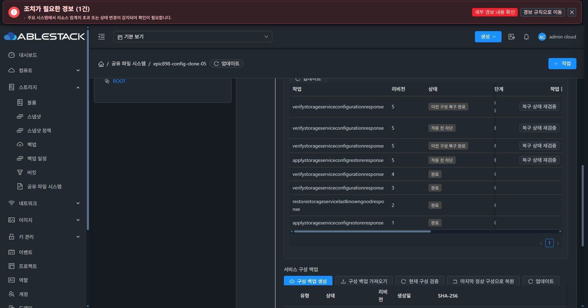

# 중단된 설정 변경 작업의 재시작 복구

미완료 RUNNING 작업이 있거나 최신 정상 revision보다 새로운 RECOVERY_REQUIRED 작업이 있으면 새 desired 변경을 만들기 전에 차단합니다. 이미 완료된 동일 idempotency 요청의 조회와 나중에 같은 revision 이상이 검증된 과거 실패는 유지합니다.

중단 복구는 동일 서비스 writer lock을 확보한 뒤 오래된 heartbeat와 실제 게스트 writer-idle capability를 확인합니다. 게스트 작업이 실행 중이면 RUNNING과 암호화 checkpoint를 유지하고 다음 bounded retry를 기다립니다. 나중에 검증된 정상 revision이 있으면 현재 구성만 검증하고 이전 snapshot으로 되돌리지 않습니다.

사전 prepare checkpoint 이전 중단은 BLOCKED로 기록하며 데이터나 게스트를 변경하지 않습니다. checkpoint 이후 중단은 DB·보호 identity·POSIX·프로토콜을 이전 상태로 되돌리고 fresh health 및 desired/runtime 일치를 검증해 ROLLED_BACK으로 종료합니다. 복구 실패는 RECOVERY_REQUIRED와 원래 진단을 보존하고 명시적 복구 재시도를 지원합니다.

관리 서버의 background worker는 오래된 RUNNING 작업을 제한 개수로 조회합니다. 동일 writer lock과 System call context를 사용하며 원래 caller의 암호화 checkpoint는 완료 상태에서만 정리합니다. 중단된 operation에 연결된 미승격 CANDIDATE는 정상 지점을 덮어쓰지 않고 FAILED로 기록하며 artifact cleanup 상태와 보존 시각을 남깁니다.

검증:
- 최신 로컬 Europa c169d9a203f49ce07e038297873bc3c24cd8ffb4에 Epic 변경을 rebase했고 번역 키를 모두 보존했습니다.
- 중단 복구·진입 제한·checkpoint·기존 복구 회귀 26개 및 module package 통과.
- rebase 후 native 72개, SharedFS UI 회귀 43개 통과.
- 배포 후 실제 관리 서버 phase별 중단 검증은 아직 진행 전입니다.

전체 native generation·취소/배수·각 프로토콜 실패 게이트는 계속 진행합니다.

실제 VERIFYING 단계 관리 서버 강제 중단 검증:
- 신규 시험 서비스의 LKG 행만 잠시 잠근 상태에서 작업 6b90d69a-98da-4e7b-b07d-f3d7a83f54c2의 RUNNING/VERIFYING과 미승격 candidate를 확인한 뒤 관리 서버 main process를 강제 종료했습니다.
- 해당 DB 잠금은 finally에서 즉시 해제했고 관리 서버를 시작했습니다. background worker가 operation 7a44f32e-14d0-4ce1-a708-f5ecee0434a8을 자동 복구해 ROLLED_BACK/INTERRUPTED_WRITER_ROLLED_BACK/100으로 종료했습니다. 별도 복구 API나 버튼을 실행하지 않았습니다.
- candidate 580d5f79-2ae0-4f22-bf77-d275e2322e52는 FAILED로 기록하고 ZIP을 제거했습니다. 기존 ACTIVE_LKG 733566e1-74f4-445b-a7c7-326d16f5b01d revision 4는 유지됐습니다.
- 기존 async job도 jobstatus=2/errorcode=530으로 종료돼 영구 진행 중에 남지 않았습니다. 실제 복구 결과는 operation 이력에서 조회합니다.
- VM boot ID, Samba PID, 파일 SHA-256·UID/GID·mode·inode·filesystem UUID와 실제 SMB 인증·읽기의 이전 출력이 정확히 일치했습니다.
- 실제 Chrome UI에서 이전 구성 복구 완료, INTERRUPTED_WRITER_ROLLED_BACK과 원래 복구 진단을 확인했습니다.

이번 중단은 구성 검증 이후 승격 직전의 read-only 검증 작업입니다. 실제 desired 변경 이후의 중단·인증 checkpoint 복구·추가 phase·전체 프로토콜·native generation은 별도 게이트입니다.

실제 SMB desired 변경 및 보호된 인증 checkpoint의 중단 복구도 검증했습니다. 공유 c0679c42-c4b3-4769-a5ae-1507241d3f93의 browseable을 true → false로 변경하고 DB·native 적용 및 VERIFYING/RUNNING/candidate를 확인한 뒤 관리 서버를 강제 종료했습니다. 작업 56e360d1-ee71-440a-b8fd-881685dc25c5의 operation 2ffd7e7d-b4ba-4f24-b440-750ff7608daa는 background worker가 자동 ROLLED_BACK/INTERRUPTED_WRITER_ROLLED_BACK으로 복구했고 browseable도 true로 돌아왔습니다.

기존 LKG revision 4를 유지했고 candidate는 FAILED로 기록했습니다. scoped DB audit로 nativeIdentityCapsule checkpoint가 실제 존재했으며 복구 완료 후 capsule와 wrapped key의 cleanup=CLEANED 및 보호 파일 제거를 확인했습니다. 비밀값·키 원문은 검사 출력에 포함하지 않았습니다. 변경 전후 데이터·inode·owner/mode·filesystem UUID·boot ID·Samba PID와 실제 SMB 인증·읽기 출력도 일치했습니다.

이 시험의 실제 UI 검증과 추가 phase·네 프로토콜·native generation은 계속 진행합니다.
