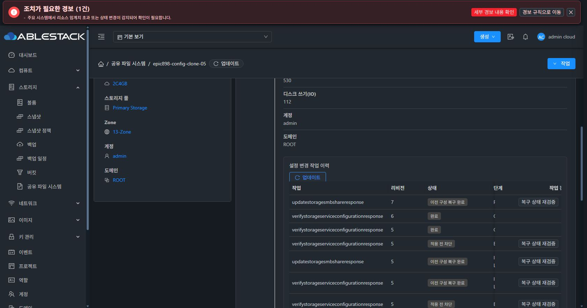

# SharedFS native configuration generation 중간 검증

## 구현과 배포

- Backend source: 2c3719d5c5b2ce44c9431182bb25a133be94faa4. 모듈 빌드 성공, backend 31개 테스트 통과.
- SystemVM source: 93a30a7397b, epic898-20261008-config-generation-agent. SystemVM 테스트 80개 통과.
- 서명 검증된 카탈로그: f15ce21b-a4d2-49cf-a827-184a4a69213b, AVAILABLE. VM 39/41/43/48/49 업그레이드 COMPLETE.
- 관리 서버 변경 클래스 14개만 교체. 다른 JAR 엔트리의 바이트 유지 검증. 관리 서버 PID 1041698, JAR SHA-256 aa058b2e8da4aba40f5ada8309031321cb2de172bffea9b1d3a636dd3c85f8b5.
- 배포 백업: /root/epic898-backup-20261008-033317.

## 정상 검증

시험 서비스 65260ea9-bdb1-4ce4-bd6e-55cd755b5c59, instance 67673fb1-f83c-4da7-a395-14d3f5321fe7.

1. 첫 API 상태 조회는 호스트 agent가 전달한 빈 payload 파일을 JSON으로 해석해 BLOCKED로 종료했다. 기존 revision 4와 ACTIVE_LKG는 유지됐다. 실제 전송 방식에 대한 회귀 테스트를 추가한 수정 런타임으로 재검증했다.
2. API 검증 job 7f7f20cb-abcb-4a3b-8cbe-9c8e1c800c30 완료. operation 7b6c6865-0c9f-485f-9d38-b5c50facb614의 desired/runtime revision 5가 일치했다.
3. Chrome 상세 화면의 **현재 구성 검증** 버튼으로 다음 검증을 실행했다. operation 7612d2f2-2943-45dc-bba9-172404abf8c1, desired/runtime revision 6, ACTIVE_LKG b3b868ec-15aa-4651-a4c3-6fd75f94192b.
4. native status: IN_SYNC, pendingOperationUuid null. 설정 SHA-256 88964cf84c63637f52736d8f2f1ba08350098c8950efd9245d11e36420e72f8e.
5. 기존 UI의 구성 복원 지점은 즉시 갱신되지만 작업 이력은 별도 업데이트를 요구하는 문제가 발견됐다. 작업 종료 이벤트와 scoped 이력 갱신, generation 검증 메타데이터 표시를 보완했다. 관련 UI 테스트 27개 통과. 새로운 UI 산출물 배포·실제 화면 검증은 별도 기록한다.

## 실제 SMB 변경 후 native commit 보상 롤백

- 공유 c0679c42-c4b3-4769-a5ae-1507241d3f93 browseable true → false 변경.
- job d88ae4cf-856e-40b0-800e-b102c4ff5179, operation e7a79664-51b2-461a-a1b1-18922648ecce, staging revision 7.
- 시험 서비스의 활성 포인터 행만 잠근 상태에서 prepared CANDIDATE를 관측했다. native commit 이후 해당 서비스의 정확한 DB promoter 연결에만 연결 중단을 주입했다. 전역 DB 설정이나 권한은 변경하지 않았다.
- API jobstatus 2, operation ROLLED_BACK 100, candidate FAILED. 이전 ACTIVE_LKG revision 6이 유지됐다.
- 이전 SMB browseable true, native runtime revision 6, IN_SYNC, pending null로 복구됐다.
- 별도 VM41의 실제 SMB 인증 읽기 성공, 아래 기준 데이터 hash 일치. 보호 capsule과 키는 기존 cleanup 경로를 사용한다.
- DB pause guard는 finally에서 rollback/연결 종료됐다. 사용자 DATA를 삭제하거나 포맷하지 않았다.

| 기준 | 검증 후 및 롤백 후 |
| --- | --- |
| DATA filesystem UUID | 5108fdba-7bb0-4b7a-907d-be4b35970767 |
| 기준 파일 SHA-256 | bb4a726771dac07790d3ad29f65bc839b73bfdef5ab5df842edb827bf6c031d0 |
| UID/GID, mode, inode | 1001001:1001001, 0775, 16777346 |
| VM boot ID | 5ce47946-391f-4be3-8b94-93ebe31751ac |
| Samba master PID | 1015 |

Chrome의 작업 이력 업데이트로 revision 7 **이전 구성 복구 완료**와 정상 검증 revision 6/5를 확인했다.

## 완료 범위의 한계

generation journal과 current 포인터의 원자 교체, revision 일치 승격, 보상 롤백의 이번 경로를 검증했다. 네 프로토콜 전체 rendered 설정의 원자 교체, 여러 중단 단계와 재부팅, 장기 작업 drain/cancel, 구성 복구 전체 수명주기와 최종 UI 정리 완료를 의미하지 않는다. Epic #898의 #892/#897/#909는 계속 진행한다. SMB AD만 사용자 요청으로 보류한다.
