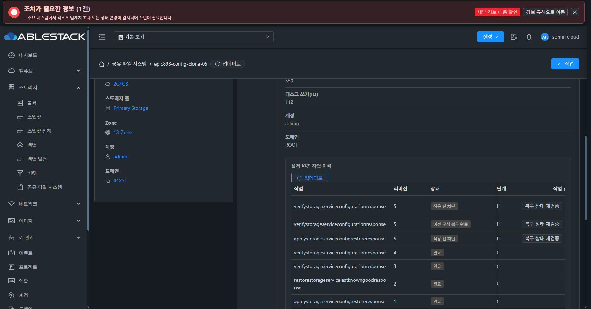

# 중단된 변경 작업 복구를 위한 native writer 잠금 기반

native 변경 명령은 보호된 파일의 flock을 획득하고 명령이 끝날 때까지 descriptor를 유지합니다. 관리 서버가 중단돼도 게스트 작업이 계속 실행 중이면 다음 변경과 writer-idle/preflight는 STORAGE_WRITER_BUSY로 차단합니다. 공개 관측 조회는 잠금 대기로 멈추지 않습니다.

잠금 파일의 owner·mode·symlink 및 부모 쓰기 권한을 검사합니다. 중첩 native 복구는 같은 descriptor를 상속하고, 암호화된 NVMe identity 재적용도 해당 descriptor만 전달해 잠금을 유지합니다. 관리 서버의 RUNNING/RECOVERY_REQUIRED 작업은 암호화된 복구 자료를 삭제하지 않으며 완료·rollback 등 확정된 terminal 상태에서만 정리합니다.

조사 중 NFS idmapping preflight가 이후 실제 export 적용으로 이어지는 제어 흐름 결함을 발견했습니다. 사전 점검 성공 후 종료하도록 수정했습니다. 이전 소스의 실제 명령 분기를 실행한 통제 회귀는 UNEXPECTED_MUTATION으로 실패했고 수정 소스는 통과했습니다.

검증:
- 실제 flock 경쟁, symlink/쓰기 가능한 부모 거절, 중첩 Bash 및 Python descriptor 상속, NFS preflight 비변경 회귀를 포함해 native 70개 통과.
- 미완료 checkpoint 보존과 rollback 후 지정된 두 파일만 정리하는 회귀 및 원자적 변경 회귀를 모듈 package로 검증.

아직 native 런타임 배포·실제 경쟁 차단 검증과 관리 서버 재시작 후 작업 재개·generation·취소/배수 완료 게이트는 남아 있습니다.

서명된 writer-lock runtime을 신규 시험 VM에 실제 적용했습니다. fa896cf9-b3c4-4ce2-aec7-8017e58ee821은 COMPLETE입니다. 게스트에서 실제 flock을 보유한 동안 operation preflight와 writer-idle이 exit 75/STORAGE_WRITER_BUSY로 차단됐고, 공개 NFS numeric preflight는 성공했습니다. Ganesha 설정 파일 3개의 SHA-256은 정확히 같았고 잠금 해제 후 idle probe가 성공했습니다.

보호된 프로토콜 재적용의 /dev/stdin 입력은 내장 Python 스크립트 stdin과 충돌하고 여러 단계의 재읽기에 실패할 수 있어 추가 보강했습니다. 일반 stdin payload를 mode 0600의 sealed memfd로 전달하고 모든 단계가 descriptor 경로로 읽도록 했습니다. plaintext 파일이나 비밀값 인자를 만들지 않으며 상속 writer descriptor도 유지합니다. 실제 CLI stdin과 독립적인 여러 reader·변경 불가·임시 파일 미생성 회귀를 포함해 native 72개가 통과했습니다. 추가 runtime 배포 검증은 계속 진행합니다.

추가 signed writer-stdin runtime을 작업 f248c229-19a0-490c-802d-25f59590539f로 실제 적용했고 COMPLETE를 확인했습니다. 새 코드의 /dev/stdin NFS numeric preflight가 성공했으며 Ganesha 설정 파일 3개가 그대로 유지됐습니다.

신규 시험 VM에서 30초 후 자동 해제되는 native 변경 잠금을 보유한 동안 관리 서버의 현재 구성 검증 API를 실행했습니다. 작업 a3386f8e-f43e-457d-aac1-cd3d93081eab는 STORAGE_WRITER_BUSY로 적용 전에 BLOCKED가 됐고 기존 ACTIVE_LKG revision 4를 유지했습니다. 잠금 해제 후 writer-idle과 기준 데이터 파일 SHA-256 유지도 확인했습니다. 실제 Chrome UI의 이력에서 적용 전 차단과 원래 진단을 확인했습니다.

이 검증은 현재 변경 잠금 경쟁과 사전 차단 범위입니다. 관리 서버 중단 후 durable 작업 재개와 native generation의 전체 완료 게이트는 계속 진행합니다.
