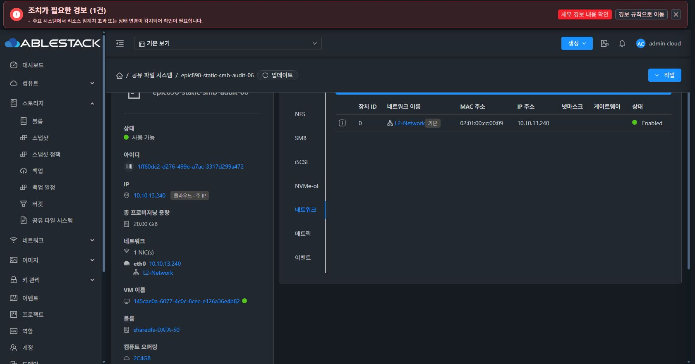
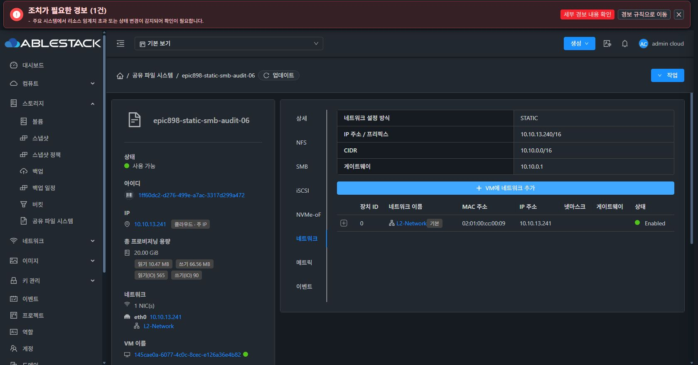

# Epic #898 ROOT 업그레이드 API/UI 및 실제 SMB 인수 진행

2026-10-08 진행 기록이다. SMB AD 기능은 사용자 요청에 따라 보류한다. 아래 구현과 테스트는 아직 전체 Epic 또는 개별 이슈의 완료를 뜻하지 않는다.

## ROOT 기능

커밋 4e2f3187a9314d7f4d46aa194931aea6462095bf는 템플릿 목록·호환성·사전 검증·실행·이력·롤백·보존 ROOT 정리 API를 실제 실행 단계에 연결한다. 같은 VM에서 기존 ROOT를 보존하고, 정상 종료 이후 교체하며, 보호된 로컬 identity와 기존 DATA의 파일 시스템 UUID를 검증한다. 모든 DATA 복구는 MOUNT_EXISTING이고 재포맷하지 않는다.

관리 서버 재시작 복구와 서로 충돌하는 설정·runtime·VM 수명주기 작업의 차단을 포함한다. 기본 보존 시간은 168시간이며, 정리는 보존 기간 만료 후 정확한 서비스 이름 확인을 요구한다. production DDL은 storage_service_template_upgrade 테이블과 storage_service_instance의 current_template_id, previous_template_id, template_upgrade_state, last_template_upgrade_id, template_verified_at 5열이다. DDL은 새 jar 적용과 서비스 시작 전에 적용해야 한다.

focused Maven package는 ROOT 관련 43개와 SharedFS 41개, 합계 84개 테스트가 실패·오류 없이 통과했다. 원본 로그는 WSL scratch의 root-real-backend-final-tests-build.log다. 새 ROOT의 실제 signed runtime 계보 일치와 static NIC 보호, 실제 template 빌드·배포·ROOT 교체·역교체·전 단계 실패 주입은 별도 인수 게이트로 남아 있다.

UI 코드 a16a88d42cd는 target을 명시적으로 선택한 뒤 사전 검증 결과, 세션 수, 보존 DATA 수, identity 이관, rollback 가능 여부를 확인하게 한다. maintenance 확인과 정확한 서비스 이름이 맞아야 실행한다. async job은 모달을 닫은 뒤 추적하며, 이전 리소스의 늦은 응답과 unmount 이후 callback을 격리한다. 관련 9개 UI 테스트가 통과했다. 첫 production 빌드는 마지막 요청 객체의 lint 오류로 실패했고 형식을 수정한 뒤 재빌드가 통과했다. UI a16a88d42cd744925f9b2164dfa6037cca28f78b를 844개 static 파일로 배포했고 모든 hash와 config.json·WEB-INF·관리 서버 PID 보존을 검증했다. index SHA-256은 4ace4e1b648f32e8f4bb3d321105493a6a75ea4cbd95fc996732f32f342a567e이고 backup은 /root/epic898-ui-backup-20261008-102139다. 새 ROOT API backend는 아직 배포하지 않았으므로 ROOT UI의 실제 실행 인수는 남아 있다.

## 실제 새 테스트 VM에서 발견한 SMB / STATIC 결함

별도 SharedFS 1ff60dc2-d276-499e-a7ac-3317d299a472의 기본 IP는 10.10.13.240/16, gateway는 10.10.0.1이다. 초기 생성·재부팅 후 static 설정과 DHCP 비활성화, 기존 SMB 파일 hash/owner/mode/inode 보존을 확인했다.

두 번째 SMB IP 10.10.13.241:445는 API/UI에 READY로 표시됐지만 실제 TCP 접속이 거절됐다. 같은 IP 재요청은 endpoint UUID를 보존했고, 재부팅 뒤에도 B의 리스너가 없었다. 171fa063ad5ac1cc40a9db012107b517dd4e6e36은 요청한 모든 IP가 NIC에 있고, 해당 IP×port의 smbd 소유 LISTEN socket과 실제 TCP 접속이 성공해야 성공을 반환하도록 보완한다. 100 endpoint를 포함한 총 deadline 검증과 native 회귀를 통과했다. 이 커밋은 아직 실제 VM에 배포하지 않았다.

Samba 4.17의 신규 binding을 별도 endpoint master로 추가하는 prototype은 실제 테스트 VM에서 같은 local 계정 인증, 양 endpoint 파일 읽기/쓰기, cross-endpoint byte-range lock, A의 열린 descriptor 유지 및 B 리스너 선택 종료를 통과했다. 868번 fsync/read/write 중 오류는 0이고 최대 관측 지연은 0.014204초였다. 정식 renderer/unit/journal/rollback/boot/API/UI 적용과 회귀는 계속 진행한다.

재부팅 후에는 management의 IP 조회가 보조 IP B를 기본 IP로 선택해 NIC DB를 240에서 241로 덮어쓰는 별도 P1을 확인했다. 실제 로그와 DB 관측으로 확인했으며 인위적인 NIC 복구를 적용하지 않았다. STATIC declared primary 보호 및 host agent IP 선택 회귀 수정을 진행한다.

원래 SharedFS 39/41 및 기존 검증 fixture49의 DATA를 삭제하거나 포맷하지 않았다. 이슈 #900/#913/#920은 인수 완료 전 OPEN을 유지한다.

## 적용된 DDL 및 실제 네트워크 UI

최소 DDL SHA-256 2f73ca6805c5789a5b7fc79af9c4e1dce76e19ec1b0105bfbd3240cf0bf4822c를 적용한 후 같은 스크립트를 재실행해 idempotency도 확인했다. ROOT 테이블의 unique constraints와 인스턴스 projection 5열을 검증했고 기존 instance 7행을 보존했다. backend 교체·관리 서버 재시작·ROOT swap은 수행하지 않았다.

실제 Chrome에서 SharedFS50의 네트워크 탭을 열어 STATIC, 10.10.13.240/16, 10.10.0.0/16 및 10.10.0.1 표시를 확인했다. 기존 Generic NIC API가 L2의 netmask/gateway를 제공하지 않으므로 SharedFS 설정값을 함께 표시한다. 현재 DB NIC의 B241 drift는 숨기지 않고 별도 원인 수정 후 재검증한다.

