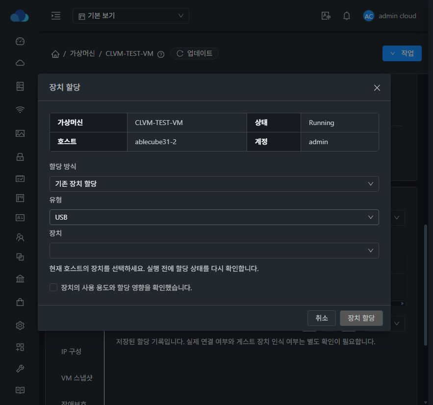
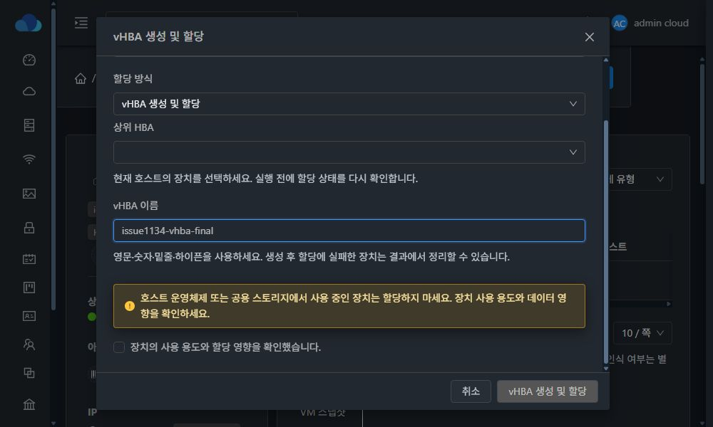
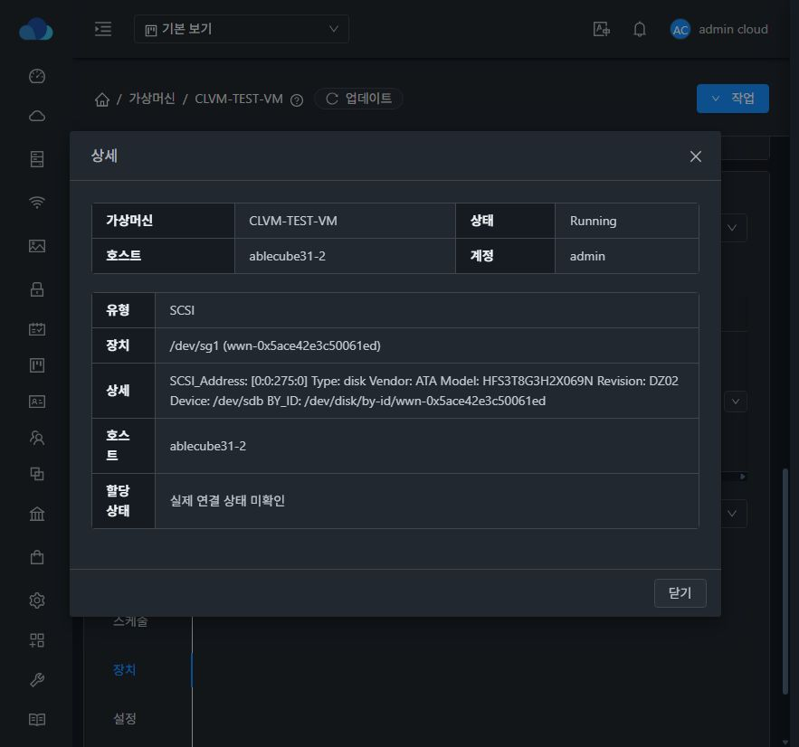

<!--
Licensed to the Apache Software Foundation (ASF) under one
or more contributor license agreements. See the NOTICE file
distributed with this work for additional information
regarding copyright ownership. The ASF licenses this file
to you under the Apache License, Version 2.0 (the
"License"); you may not use this file except in compliance
with the License. You may obtain a copy of the License at

  http://www.apache.org/licenses/LICENSE-2.0

Unless required by applicable law or agreed to in writing,
software distributed under the License is distributed on an
"AS IS" BASIS, WITHOUT WARRANTIES OR CONDITIONS OF ANY
KIND, either express or implied. See the License for the
specific language governing permissions and limitations
under the License.
-->

# 이슈 #1134 검증 기록

## 구현 범위

- VM 장치 탭을 단일 테이블, 검색/유형 필터/페이지, 장치 할당 및 행별 해제/추가 작업으로 통합한다.
- 기존 6종 장치 API를 사용한다. `listVmDeviceAssignments`에 호스트 UUID를 추가하고 해제 대상 UUID를 서버에서 내부 ID로 정규화한다.
- 서버는 VM 소유권, 호스트 일치, VM 상태, 스냅샷, 기존 할당을 검사한다. 호스트별 잠금으로 중복 할당 경쟁을 막는다.
- PCI는 정지 VM의 설정 변경이며 다른 유형은 실행 VM에 적용한다. 실제 연결 상태를 DB 기록만으로 정상이라고 표시하지 않는다.
- 런타임 미사용을 증명할 기존 API가 없어 잔여 설정 정리는 비활성화한다. 조회 오류만으로 자동 정리하지 않는다.
- vHBA 생성과 할당을 분리해 부분 실패 시 생성된 장치를 보존하고 미할당 삭제를 제공한다. 하위 SCSI 주소를 추측하지 않는다.
- 관리 USB/허브를 선택에서 제외하고 물리 FC 포트를 vHBA로 오인하지 않도록 부모 관계를 확인한다.
- 모든 대화상자는 중앙 정렬, 제목/버튼 고정, 본문만 스크롤하며 다크/라이트 테마를 따른다.

## 빌드 및 자동 검증

WSL ext4 작업 트리에서 변경된 `api`, `server`, `core` 모듈과 UI만 빌드한다. 전체 Cloud/RPM 빌드는 수행하지 않는다.

- 서버 가드 테스트: 6개 통과.
- UI 상태/주소 변환 테스트: 9개 통과.
- vHBA 삭제 응답 직렬화 테스트: 수정 전 중복 `details` 필드 오류 재현, 수정 후 통과.
- UI ESLint 및 Apache RAT 라이선스 검사 수행.
- 기존 upstream 라이선스 실패를 해소하는 PR #1131의 헤더/검사 제외 수정 커밋을 재사용한다.

## 실제 장치 검증

31번 클러스터의 `CLVM-TEST-VM`, `ablecube31-2`에서 수행했다. 운영 스토리지에 사용 중인 FC LUN 3개와 해당 HBA 전체, iDRAC 관리 USB는 할당 테스트에서 제외했다.

1. 로컬 디스크 `/dev/sdb`와 SCSI `/dev/sg1`은 파일시스템 서명, 마운트, LVM PV, 열린 사용자, VM 연결이 없음을 확인했다.
2. VM 장치 탭에서 SCSI `[0:0:275:0]`을 할당했다. libvirt의 `hostdev`와 QGA `guest-get-disks`의 추가 디스크 `/dev/sdc`를 확인했다. 포맷·쓰기 작업은 하지 않았다.
3. UI에서 해제 후 할당 API 기록과 hostdev가 제거되고 게스트 추가 디스크가 사라짐을 확인했다. 기존 ROOT/DATA 볼륨과 VM Running 상태는 유지됐다.
4. NPIV 테스트 vHBA를 생성했다. SAN 하위 SCSI 장치가 없는 경우 할당을 중단하고 부분 실패와 생성 식별자를 표시했다.
5. 삭제 테스트에서 기존 응답 클래스의 중복 JSON 필드 때문에 API 완료가 전달되지 않는 문제를 발견했다. 부모 `Answer.details`를 재사용하도록 수정했다.
6. 이름으로 삭제할 때 WWNN 기반 백업 XML이 남는 문제도 수정했다. 삭제 전 실제 WWNN을 조회해 대응 파일만 정리한다.
7. 수정 후 UI에서 다시 생성/삭제했다. `DeleteVhbaDeviceAnswer.result=true`, 대화상자 종료, NPIV 포트 수 0, `/etc/vhba`에 테스트 백업 없음까지 확인했다.
8. 최종 UI에서 SCSI 할당·해제를 반복하고 중복 할당 API가 거부됨을 확인했다. 모든 테스트 장치를 해제한 뒤 기존 볼륨 XML과 일치하고 QGA ping이 정상임을 확인했다.

## 화면 검증

- 다크모드 정보 표의 흰 배경을 수정하고 실제 화면에서 테마 배경·레이블·값을 확인했다.
- 이전/다음 페이지 화살표의 기본 흰 배경을 제거하고 버튼의 배경·테두리·비활성 색상을 테마에 맞췄다.
- 1000×600 화면에서 대화상자는 y=24, 높이=552px. 본문 scrollTop 0→102px 이동 시 제목 y=24, 하단 버튼 y=523이 유지됐다.
- 대표 작업은 할당 해제, 나머지는 드롭다운이며 상세는 마지막이다. VM 스냅샷이 있는 대상에서는 할당 버튼 비활성화와 사유를 확인했다.
- 다크/라이트 대화상자, 긴 장치명, 부분 실패 결과, 본문 스크롤을 실제 배포 UI에서 확인했다.

## 배포 및 검증 경계

- 관리 서버는 수정 클래스를 기존 패키지 JAR에 반영하고 백업을 보존했다. 추가 `core` 변경은 31-2에서 검증한 뒤 31-1/31-3에도 반영했고 각 호스트의 기존 VM 목록이 유지됨을 확인했다.
- UI는 기존 PR #1131/#1133의 테스트 배포 내용을 유지하는 통합 검증 브랜치에서 빌드한다. 이 PR의 기능 diff에는 해당 UI 변경을 섞지 않는다.
- 정적 파일만 갱신하고 `WEB-INF`, `config.json`을 보존한다. 배포 후 파일 해시, 서비스 상태 및 `/client/` HTTP 200을 확인한다.
- 모든 장치 종류의 실제 할당이나 재시작 지속성을 검증한 것은 아니다. USB/물리 HBA/FC LUN 후보는 관리 또는 공용 스토리지에 사용 중이므로 제외했다. PCI 실제 할당도 이번 검증 범위에 포함하지 않았다.
- vHBA의 실제 SAN LUN 할당 성공은 별도 zoning/mapping 환경에서 추가 검증이 필요하다. 생성·부분 실패·미할당 삭제 경로와 SCSI 실장치 왕복 테스트를 구분해 보고한다.
