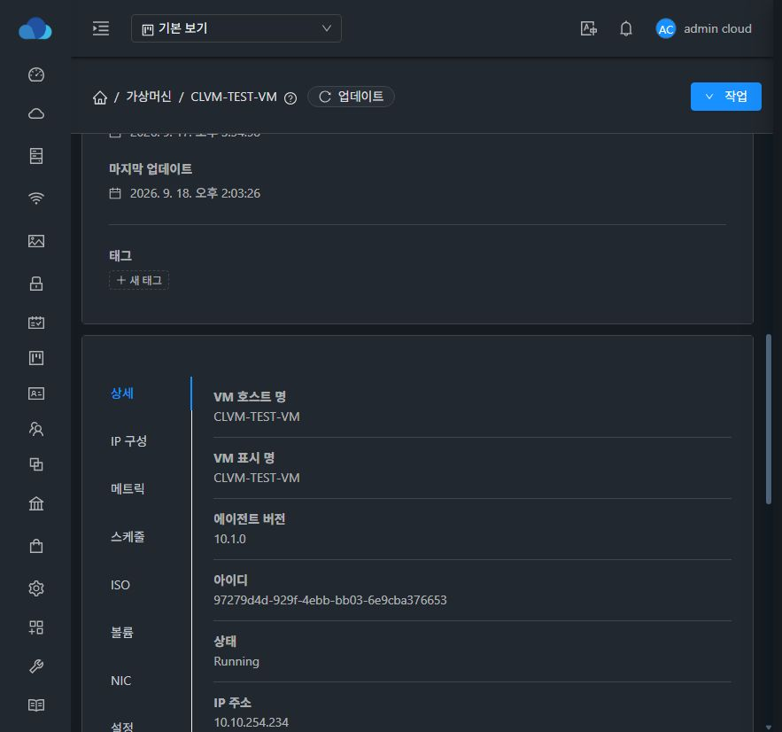
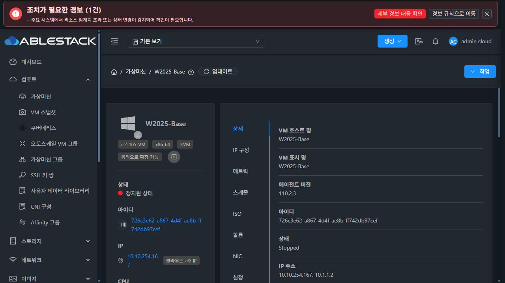
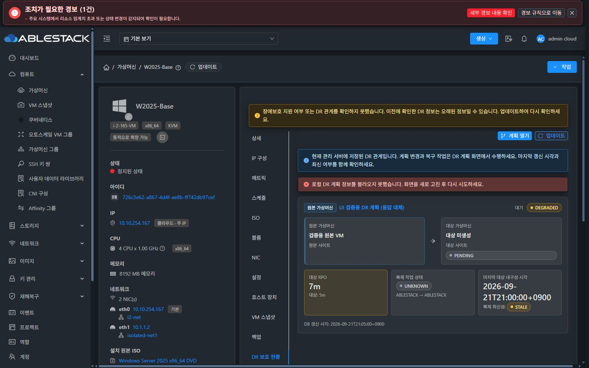
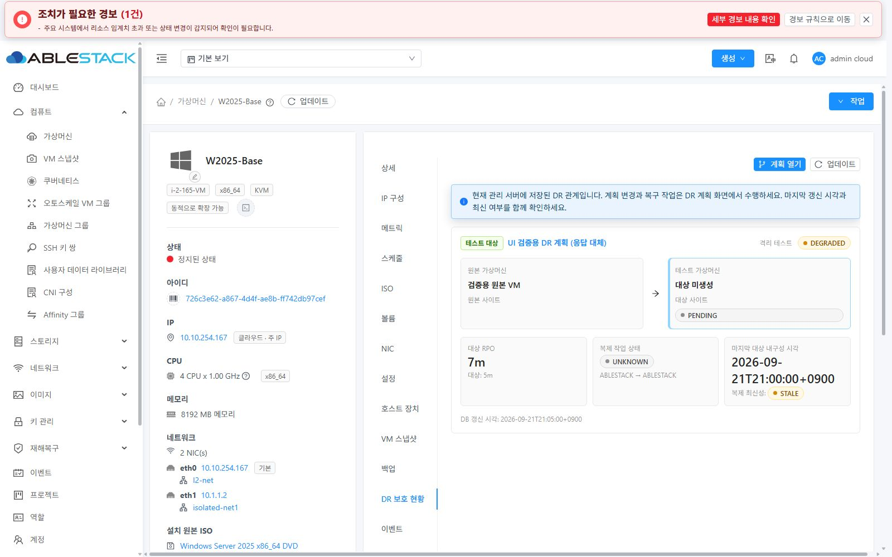

<!--
Licensed to the Apache Software Foundation (ASF) under one
or more contributor license agreements.  See the NOTICE file
distributed with this work for additional information
regarding copyright ownership.  The ASF licenses this file
to you under the Apache License, Version 2.0 (the
"License"); you may not use this file except in compliance
with the License.  You may obtain a copy of the License at

  http://www.apache.org/licenses/LICENSE-2.0

Unless required by applicable law or agreed to in writing,
software distributed under the License is distributed on an
"AS IS" BASIS, WITHOUT WARRANTIES OR CONDITIONS OF ANY
KIND, either express or implied.  See the License for the
specific language governing permissions and limitations
under the License.
-->

# 이슈 1145: VM 보호 탭 표시 조건

## 구현
- 장애보호는 API 권한과 서버와 동일한 명시적 pc-i440fx-* 계약을 함께 검사한다. q35/pc-q35/pc 별칭/미지정은 숨긴다.
- DR 보호 현황은 기존 getDrVmProtectionView의 관계가 있을 때만 표시한다. 머신 타입 조건과 독립적이다.
- 부모 화면이 조회 상태와 결과를 관리하고 DR 본문은 결과를 전달받는다. 중복 조회, 이전 VM/이전 요청 응답 반영을 방지한다.
- 로딩/조회 실패를 관계 없음과 구분하며 오류 안내와 재시도를 제공한다. 같은 VM의 확인된 DR 정보는 실패 시에도 남긴다.
- 비지원/무권한/관계 없음이 확인된 직접 URL은 상세 탭으로 정상화한다. VM 탭 이력의 실제 URL을 반영하고 popstate listener를 해제한다.
- FT 본문은 해당 탭을 선택한 동안만 생성해 숨김/이탈 시 폴링을 중단한다.
- DR 본문에 로컬 관리 범위, 갱신 시각, freshness를 표시한다. 읽기 전용 현황과 계획 이동만 제공한다.

## 검증 범위
UI 변경이다. 전체 Cloud/RPM 빌드, DR 생성/페일오버/페일백, 보호 등록/해제는 수행하지 않는다.

### 자동 검증
- 변경 파일 ESLint 통과.
- 보호 조건/비동기 응답/DR 본문 테스트 22개 통과.
- 기존 PR #1144 백업 UI를 배포본에 통합한 뒤 관련 회귀 테스트 포함 33개 통과.
- PR 소스 Apache RAT: Unapproved 0 / Unknown 0.

### 실제 환경 사전 확인
- 13번: getFtctlProtection/getDrVmProtectionView 제공. W2025-Base의 ftmachinecompatible=false, DR configured=false, LOCAL_CONTROLLER.
- 31번: getFtctlProtection 제공, getDrVmProtectionView/listDrPlans 미노출. CLVM-TEST-VM의 ftmachinecompatible=false.
- 두 클러스터에 현재 DR 계획/복제 대상/테스트 세션이 없으며, 기존 VM에 명시적 kvm.guest.os.machine.type 값이 없다.
- 지원/DR 역할별 화면은 별도로 브라우저의 읽기 API 응답을 대체하는 테스트로 구분한다. 서버 DB나 VM 설정에 테스트 보호 관계를 넣지 않는다.
- 기존 PR #1144의 백업 UI 개선을 보존한 WSL ext4 통합 소스로 배포한다. #1144 코드는 이번 PR diff에 포함하지 않는다.

### 실제 배포 및 브라우저 확인
- WSL ext4 UI 모듈 production build 통과. 표시 버전: v4.10.0-Europa-20260918.
- 배포 소스: 기능 커밋 3ac1988565c + 기존 PR #1144 통합 커밋 2be8e52e720.
- 13/31번 모두 정적 파일 829개 SHA256 일치, WEB-INF/config.json 보존, mold active, /client/ HTTP 200.
- 관리 서버 PID 유지: 13번 3426, 31번 273539. 백업: /root/issue1145-ui-backup-20260921.
- 배포 아카이브 SHA256: 5870189d3f960e2010d4d412267debbc74907c8e7dac2d4adee9fc68a9b9dc5b.
- 두 클러스터의 실제 VM에서 장애보호/DR 탭이 숨겨지고, ?tab=ftctl 및 ?tab=drplans 직접 진입이 ?tab=details로 정상화되는 것을 브라우저로 확인했다.
- 13번의 백업 탭 등 기존 탭은 유지된다. 31번은 DR API 미노출 상태에서도 오류 없이 기존 탭을 표시한다.

### 배포 UI의 응답 대체 검증 (실제 DR 실행 결과 아님)
13번 배포 UI의 별도 브라우저 탭에서 읽기 XHR 응답만 대체했다. DB/VM/보호 설정 변경 없이 다음을 확인했다.
- q35 VM도 DR 관계가 있으면 DR 보호 현황이 표시되며 장애보호는 숨겨진다.
- SOURCE + STANDBY, RECOVERY_TARGET + ACTIVE, TEST_TARGET + TEST_ISOLATED 역할 및 권한을 구분한다.
- 관계 충돌, 대상 미생성, UNKNOWN, STALE, 마지막 갱신 시각을 표시한다.
- 조회 HTTP 503에서 경고/오류를 표시하고 기존 관계 및 선택 탭을 유지한다. 업데이트 재시도로 복구한다.
- 관계 없음 응답으로 갱신하면 DR 탭을 숨기고 상세로 이동한다.
- 명시적 pc-i440fx-9.2 응답은 장애보호 탭을 표시한다. 상세 탭으로 이동한 뒤 추가 getFtctlProtection 호출이 없음을 확인했다.
- 다크/라이트 테마에서 안내, 역할, 상태, 버튼과 본문을 시각적으로 검토했다. 테마는 다크로 복원했다.
- 응답 대체 해제 후 실제 데이터로 다시 로딩하여 DR/장애보호 탭 숨김을 재확인하고 테스트 탭을 닫았다.

실환경에는 지원 머신 타입을 명시한 VM 및 DR 관계가 없으므로, 지원 VM/DR 역할별 화면 검증은 위 응답 대체와 단위 테스트 범위이다. 실제 보호 등록이나 DR 복구 기능을 검증한 것으로 해석하면 안 된다.

## 화면 증거

### 31번 실제 환경

### 13번 실제 환경

### 조회 오류와 기존 원본 관계 보존 (응답 대체, 다크)

### 테스트 대상 및 격리 상태 (응답 대체, 라이트)
