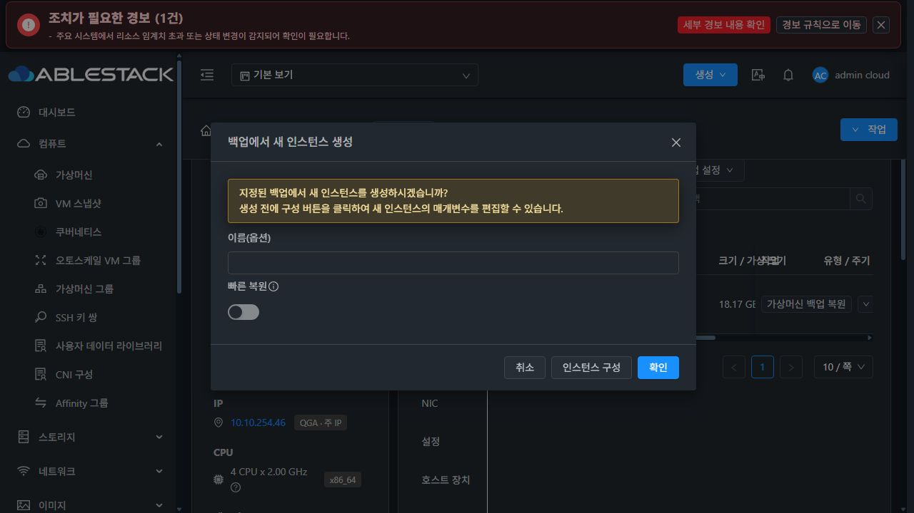
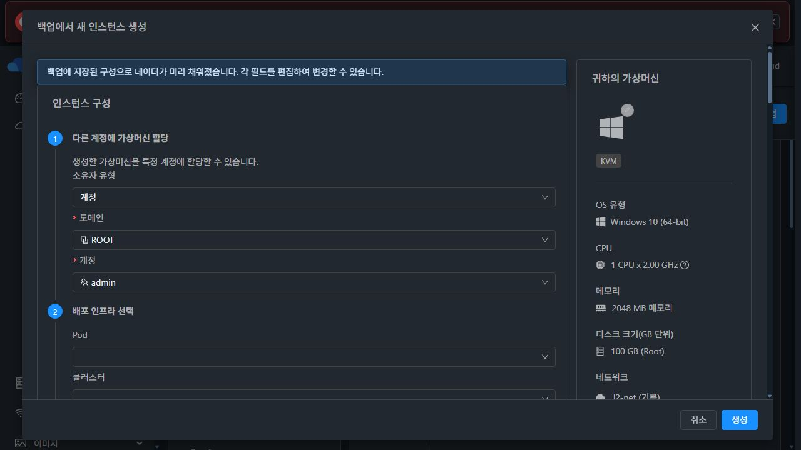
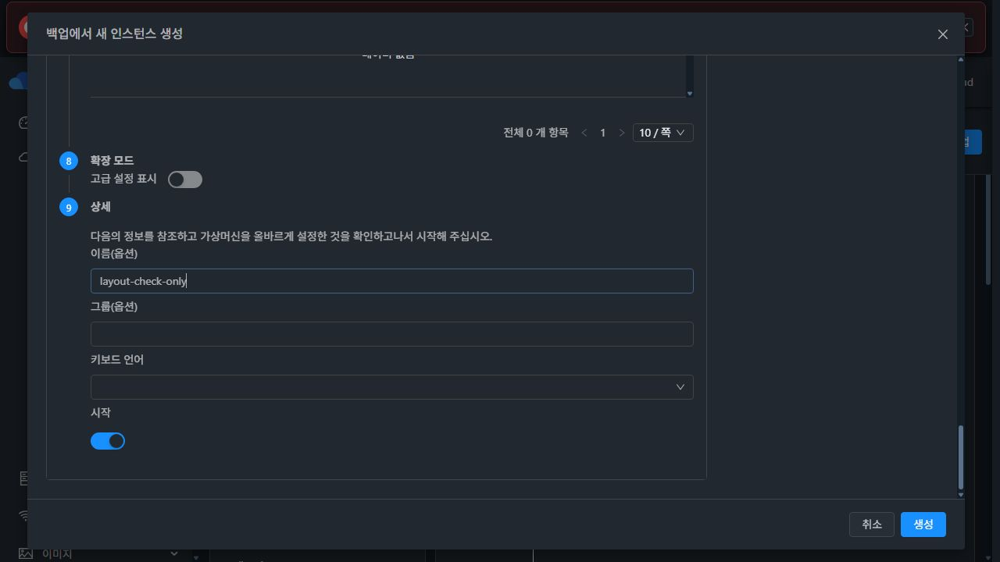
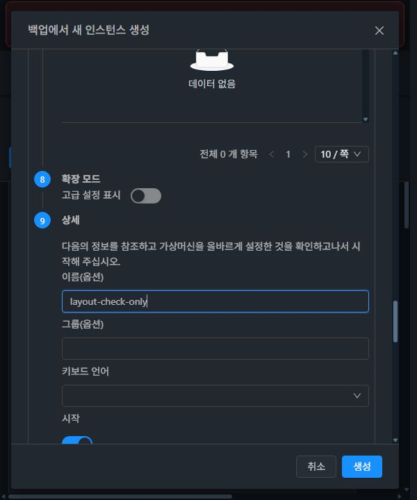
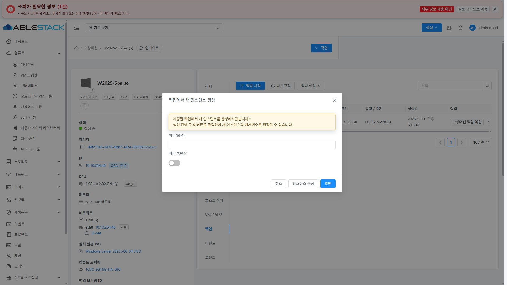
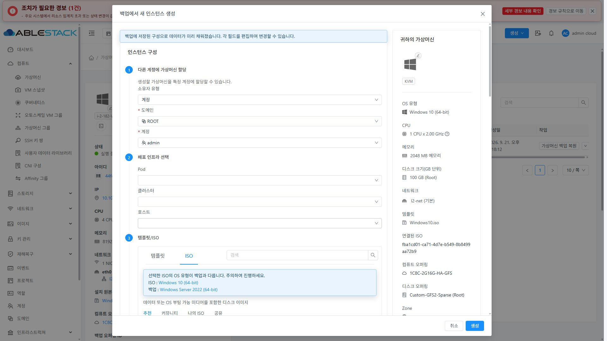

<!--
Licensed to the Apache Software Foundation (ASF) under one
or more contributor license agreements.  See the NOTICE file
distributed with this work for additional information
regarding copyright ownership.  The ASF licenses this file
to you under the Apache License, Version 2.0 (the
"License"); you may not use this file except in compliance
with the License.  You may obtain a copy of the License at

  http://www.apache.org/licenses/LICENSE-2.0

Unless required by applicable law or agreed to in writing,
software distributed under the License is distributed on an
"AS IS" BASIS, WITHOUT WARRANTIES OR CONDITIONS OF ANY
KIND, either express or implied.  See the License for the
specific language governing permissions and limitations
under the License.
-->

# 이슈 1147 검증 기록

## 변경

- 기본 생성 화면 680px, 상세 구성 최대 1200px. 실제 모달 콘텐츠의 단계 클래스로 두 호출 경로의 폭을 제어한다.
- 외부 모달은 중앙 정렬 및 화면 높이 제한, 제목과 버튼은 고정하며 콘텐츠만 스크롤한다.
- 상세 구성의 80vw를 제거하고 가용 폭을 채우는 폼과 280px 요약 카드로 구성한다. 본문 폭 900px 이하에서는 세로로 배치한다.
- 전체 페이지용 affix를 제거하고 요약 카드의 읽기 전용 동작을 유지한다.
- 기존 폼 검증/생성 API/기본 옵션 처리 로직은 변경하지 않는다.
- 닫기/재활성화/다른 백업 선택 시 상세 단계 상태를 초기화한다.

## 배포 원칙

UI 모듈만 WSL ext4에서 빌드한다. 기존 배포의 PR #1144 및 #1146 개선은 통합 빌드에 보존하고 이번 PR 변경에는 포함하지 않는다.
WEB-INF/config.json/관리 서비스 프로세스를 보존하며 정적 파일만 갱신한다.

## 검증 결과

- 변경 파일 ESLint 통과.
- 기존 백업/보호 탭 통합 회귀 테스트 3개 suite, 33개 test 통과 (`--coverage=false`).
- WSL ext4 production UI 모듈 빌드 통과. 표시 버전 v4.10.0-Europa-20260918.
- 최종 소스 Apache RAT: Unknown 0, Unapproved 없음.
- 13번 클러스터 배포 파일 829개 해시 일치, WEB-INF/config.json 보존, mold PID 3426 유지, /client/ HTTP 200.
- 배포 통합 소스 1979b56ba20, 기능 소스 67d65d54f83.
- 아카이브 SHA256: 1aa80dbb3daf92c70dc90ff06b989c9fb8959bf6802ac595327334a6492c0117.
- 서버 백업 경로: /root/issue1147-ui-backup-20260921.

### 실제 브라우저

대상: 13번 W2025-Sparse, 백업 93ff8d0a-b857-42b7-89e0-aeae0c480163. 응답 대체 없이 실제 데이터로 확인했다.

| 화면 | 모달 크기 | 결과 |
|---|---|---|
| 기본, 1280×720 | 680×376, y=172 | 중앙 배치, 내용에 맞는 폭 |
| 상세, 1280×720 | 1200×688, y=16 | 상하 16px, 본문만 스크롤 |
| 상세, 600×720 | 558×688, x/y=16 | 한 열 배치, 모달/본문 가로 넘침 없음 |
| 상세, 1920×1080 | 1200×1048, y=16 | 최대 폭 제한, 폼/요약 카드 균형 |

- 1280×720에서 본문 scrollTop 0 → 3193으로 이동해도 제목 y=16, footer y=639가 유지되었다.
- 본문 scrollWidth/clientWidth는 1280 화면에서 1190/1190, 600 화면에서 548/548로 가로 넘침이 없었다.
- 다크 및 라이트에서 기본/상세 안내, 입력, 요약, 하단 버튼을 확인했다.
- VM 백업 탭과 백업 상세의 공용 액션 모달에서 기본/상세 전환 및 취소/X 이후 재열기 기본 단계 초기화를 확인했다.
- 상세 하단 이름 필드에 테스트 문자열을 입력한 뒤 취소했다. 최종 생성/복원은 실행하지 않았다. 생성 API의 성공 검증으로 해석하지 않는다.
- 대상 VM에는 백업이 1개이므로 다른 백업 간 전환은 실데이터로 검증하지 않았다. resource.id 변경 시 configure 초기화 처리를 코드에서 확인했다.
- 백업 목록은 상세와 같은 AutogenView/액션 정의를 사용한다. 실제 브라우저 검증은 VM 탭과 백업 상세에서 수행했다.
- 검증 종료 후 테마는 다크, viewport는 기본값으로 복원하고 원래 VM 백업 탭을 열어 두었다.

## 화면

### 기본 단계 (다크)

### 상세 상단/하단 (다크): 고정 제목 및 하단 버튼

### 좁은 화면

### 라이트모드

