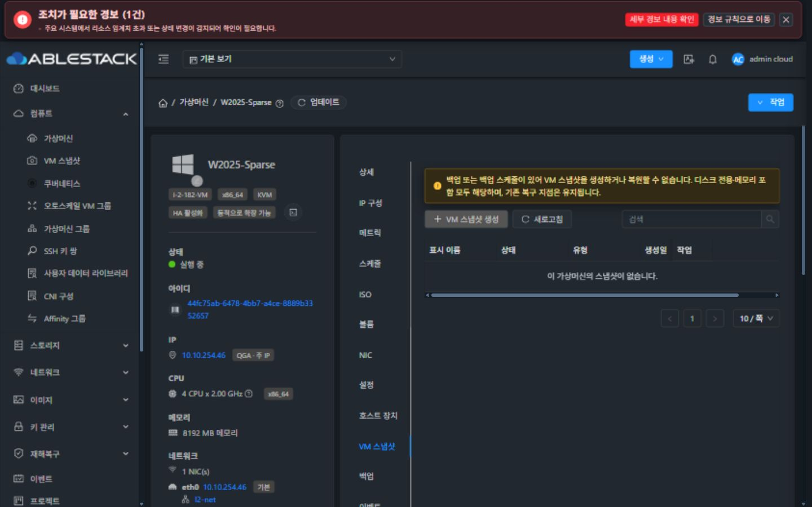
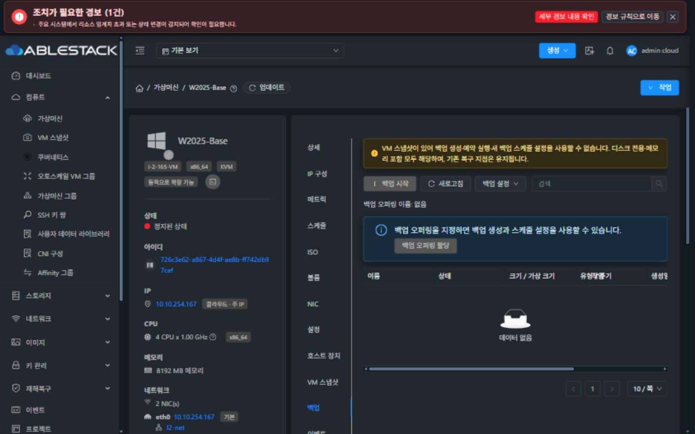
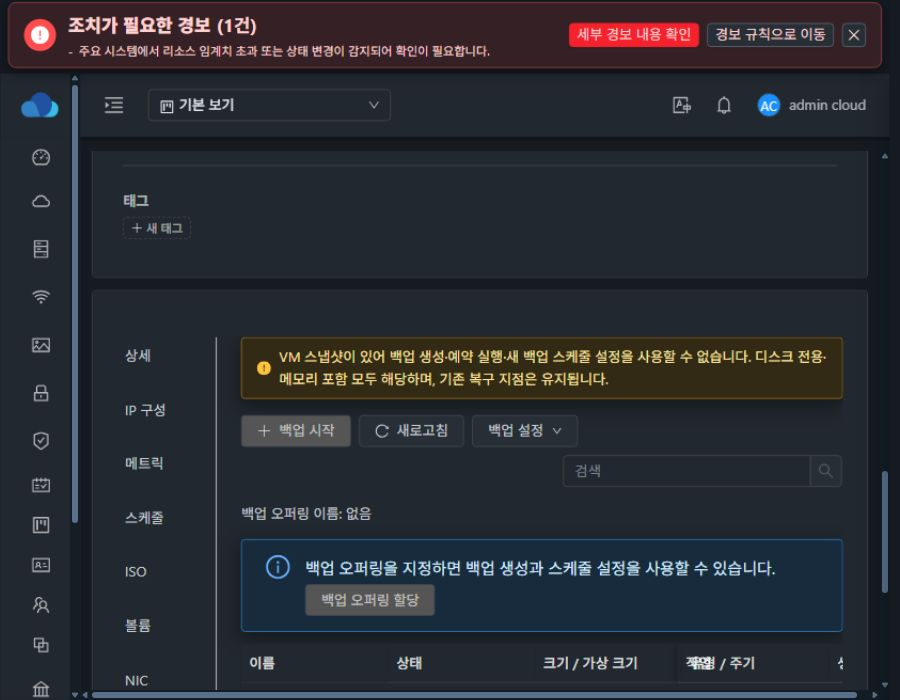
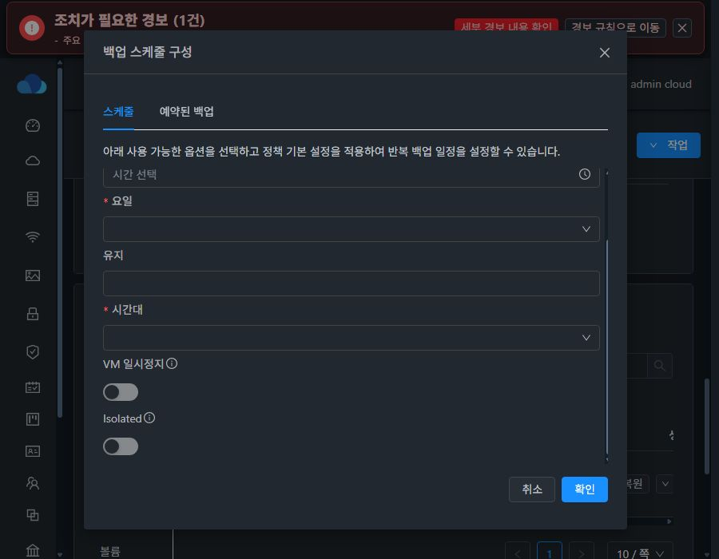

<!--
Licensed to the Apache Software Foundation (ASF) under one
or more contributor license agreements.  See the NOTICE file
distributed with this work for additional information
regarding copyright ownership.  The ASF licenses this file
to you under the Apache License, Version 2.0 (the
"License"); you may not use this file except in compliance
with the License.  You may obtain a copy of the License at

  http://www.apache.org/licenses/LICENSE-2.0

Unless required by applicable law or agreed to in writing,
software distributed under the License is distributed on an
"AS IS" BASIS, WITHOUT WARRANTIES OR CONDITIONS OF ANY
KIND, either express or implied.  See the License for the
specific language governing permissions and limitations
under the License.
-->

# Europa 백업 / VM 스냅샷 상호 방어 검증 (#1150)

## 적용 범위

- 기준 upstream: 090c478cbee (ablestack-europa).
- KVM의 공통 백업 생성, 예약 구성/실행, 오퍼링 할당과 VM 스냅샷 생성/복원에 동일 정책 적용.
- NAS의 Disk 스냅샷 공존 시험 예외 제거. 기존 NAS 원본 복원 제한 유지.
- 비 KVM에는 신규 상호 금지 조건을 추가하지 않음. 외부 백업 제공자의 독자 API 전체에 대한 검증은 하지 않음.
- 백업 오퍼링만 지정된 경우에는 이 사유만으로 차단하지 않으며 기존 provider 제한 유지.
- 공유 VM 잠금 안에서 존재 검사 및 실행. 스냅샷 할당 단계에 레코드를 남기고 실제 실행 직전에 재검사.
- 호스트의 checkpoint / dirty bitmap은 읽기 전용 사전 검사. 조회 실패는 허용하지 않음. 잔여물을 자동 제거하지 않음.
- UI 목록 조회에는 호스트 검사를 수행하지 않고 DB 사유만 제공. 실행 전 추가 검증에서 잔여물/조회 실패를 거절.

## 빌드 및 자동 검증

WSL ext4 작업 트리에서 api, core, server, plugins/hypervisors/kvm,
plugins/backup/ablestack-nas 변경 모듈만 빌드. UI production build 완료.
전체 Cloud 빌드와 전체 테스트 모음은 수행하지 않음.

- BackupSnapshotGuardTest 5건 통과.
- VMSnapshotManagerTest 21건 통과.
- LibvirtCheckVmBackupTrackingCommandWrapperTest 2건 통과.
- UserVmBackupGuardResponseTest 1건 통과: BeanUtils 메트릭 응답 복사 후 사유 보존.
- VmSnapshotsTab / vmSnapshotActions UI 테스트 16건 통과.
- 변경 Maven 모듈 및 루트 Apache RAT 라이선스 검사 통과.
- UserVmJoinDaoImplTest의 effectiveCdromMaxCountClampsToHypervisorCap는 실패.
  동일 실패(expected 1, actual 2)를 수정 없는 090c478cbee에서도 재현했으므로 기존 실패로 분리.
- 패키징 시 checkstyle은 건너뛰었고 별도 검사에서 api/core/KVM/NAS는 통과.
  server는 수정하지 않은 VmDeviceMutationTest의 기존 import 오류 2건으로 실패.
  이 파일은 기준 커밋과 동일하며 이번 변경 파일의 스타일 오류는 없음.

## 테스트 배포

- 13, 31 관리 서버 및 각 클러스터 KVM 호스트 3대에 변경 클래스 반영.
- 기존 배포의 다른 PR 변경을 보존하도록 빌드 JAR의 변경 클래스만 기존 JAR에 반영.
- 13의 구형 런타임 VmStats에는 최신 UserVmJoinDaoImpl에 필요한 기본 메서드가 없어
  동일 기준 소스의 VmStats.class도 호환 의존성으로 반영. 원본 JAR 백업 유지.
- UI는 기존 배포 PR 1144/1146/1148의 통합 기반에 이번 변경을 적용해 빌드.
  이번 소스 PR에는 해당 기존 PR 변경을 포함하지 않음.
- 각 UI에서 반영한 정적 파일 해시 확인. WEB-INF, config.json, UI 배포 시 관리 서버 PID 유지.
- 에이전트 배포 전후 실행 VM 목록 동일.

## 실제 기능 확인

### 13번

- 백업이 있는 W2025-Sparse:
  createVMSnapshot의 snapshotmemory=false/true 모두 BACKUP_EXISTS 거절.
- DiskAndMemory 스냅샷이 있는 W2025-Base 및 Disk 스냅샷이 있는
  issue1100-snapshot-validation:
  createBackup 비동기 작업 실패(VM_SNAPSHOT_EXISTS),
  createBackupSchedule 즉시 거절(VM_SNAPSHOT_EXISTS).
- 거절 검증으로 신규 백업 / 스냅샷 / 스케줄이 생성되지 않음.

### 31번

- 백업 API가 비활성화된 구성. 이 클러스터에서 백업 실행 검증을 통과했다고 간주하지 않음.
- GFS-TEST-VM의 새 메모리 포함 스냅샷 생성 성공.
  작업: 06dbd89e-c067-478d-b8aa-86e961503d58.
- 검증용 스냅샷 245c0286-7d50-4d78-ae93-feb682b3f3b2만 삭제 성공.
  작업: 52845da7-551f-4072-a694-734fbdd28d31.
- 테스트 전 기존 스냅샷 ID 집합과 테스트 정리 후 집합 동일.
- 원본 VM 복원은 실행하지 않음.

## 검증 한계

- 다중 관리 서버 동시 요청, 실패 주입, 역할별 모든 조합을 실제 환경에서 전수 실행하지 않음.
- 백업이 없는 스케줄 단독 조건은 단위 테스트로 확인.
- 실제 잔여 bitmap을 새로 주입하거나 기존 복구 지점을 훼손하는 테스트는 수행하지 않음.
- 장기 공존 / 복원 후 백업 체인 재기준화는 #1149 범위로 남음.

## UI 확인

- 13의 백업 보유 VM: 생성 버튼 비활성화 및 디스크 전용·메모리 포함 공통 제한 안내.
- 13의 스냅샷 보유 VM: 백업 시작 / 오퍼링 할당 비활성화, 안내 표시.
- 31의 충돌 없는 VM: VM 스냅샷 생성 대화상자 열기 / 취소 확인.
- 다크모드 안내 색상: 글자 rgb(255, 231, 163), 배경 rgb(51, 42, 22), 계산 대비 약 11.6:1.
- 1440x900 및 900x700에서 안내 줄바꿈과 버튼 배치 확인.
- 메트릭 API에서 BeanUtils 복사 중 사유가 누락되는 문제를 브라우저에서 발견하여 getter와 회귀 테스트 추가.

호스트 사전 검사에서 정지 VM의 도메인/디스크를 읽을 수 없는 경우도 확인 불가로 차단합니다.
이 경우 관리자가 추적 상태를 확인해야 하며, DB 빈 목록만으로 강제 허용하는 우회는 제공하지 않습니다.

### 최종 스케줄 대화상자 배포 검증

13번 실제 배포본을 새로고침한 뒤 900x700에서 주간 스케줄 화면을 확인했습니다.
임시 브라우저 스타일을 사용하지 않은 최종 검증입니다.

- 대화상자: x=105, y=37.5, width=680, height=625 (스크롤바 영역을 제외한 화면 중앙).
- 입력 영역 scrollTop: 0 → 106px.
- 스크롤 전후 제목 y=37.5, 하단 버튼 영역 y=580.5 동일.
- 백업 탭과 상단 작업 메뉴 두 진입 경로에서 동일 배치.
- 확인 버튼을 누르지 않고 취소하여 새 스케줄은 생성하지 않음.
- 두 클러스터 최종 관리 서비스 active 및 /client/ HTTP 200.

