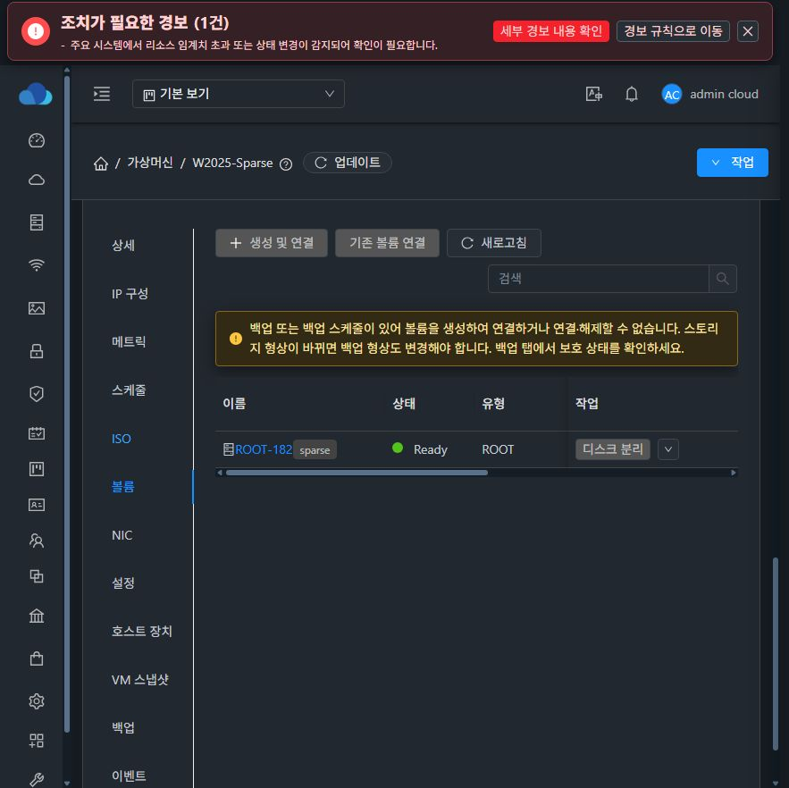
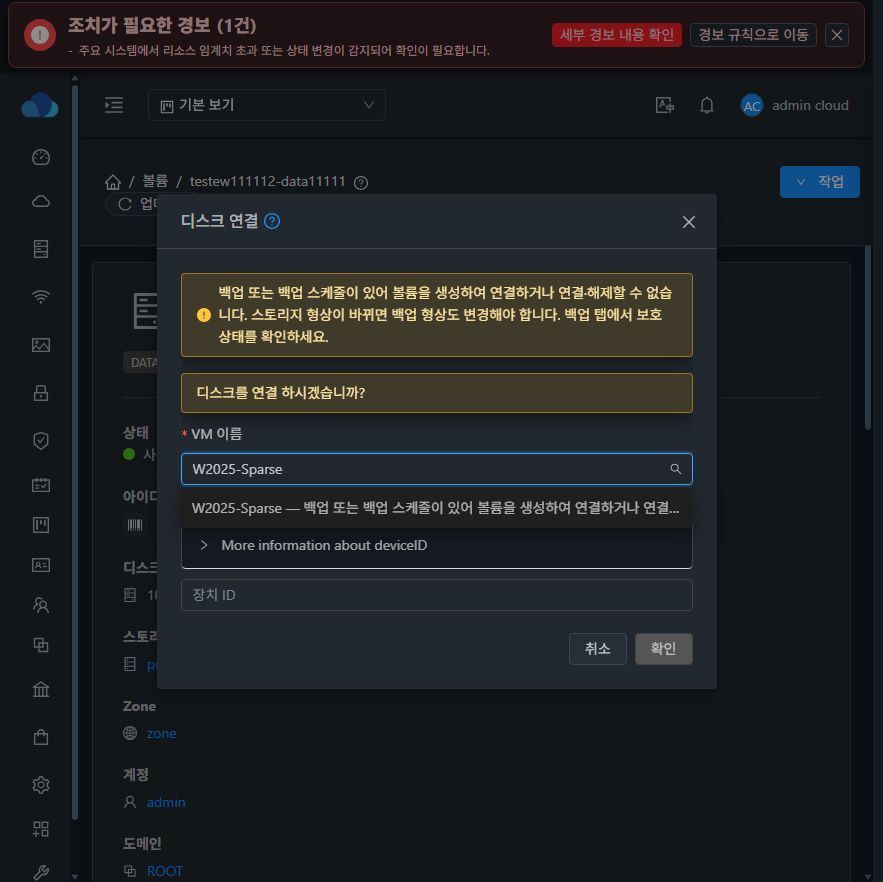
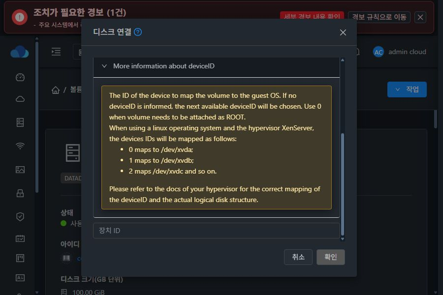
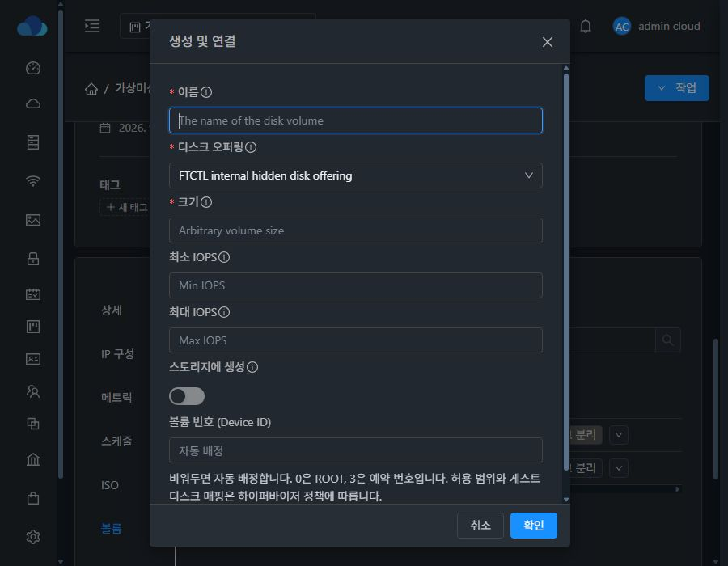

<!--
Licensed to the Apache Software Foundation (ASF) under one
or more contributor license agreements. See the NOTICE file
distributed with this work for additional information
regarding copyright ownership. The ASF licenses this file
to you under the Apache License, Version 2.0 (the
"License"); you may not use this file except in compliance
with the License. You may obtain a copy of the License at

  http://www.apache.org/licenses/LICENSE-2.0

Unless required by applicable law or agreed to in writing,
software distributed under the License is distributed on an
"AS IS" BASIS, WITHOUT WARRANTIES OR CONDITIONS OF ANY
KIND, either express or implied. See the License for the
specific language governing permissions and limitations
under the License.
-->

# Europa 백업 보호 VM의 볼륨 구성 변경 방어 검증

관련 이슈: #1152. 검증일: 2026-09-22.

## 적용 범위

- KVM VM에 백업 이력 또는 백업 스케줄이 있으면 VM 대상 생성·연결·해제를 거절한다. 전역 `backup.enable.attach.detach.of.volumes=true`도 이 보호를 우회하지 못한다.
- 오퍼링만 존재하거나 다른 하이퍼바이저인 경우 기존 백업 정책을 유지한다. 독립 미연결 볼륨 생성은 허용한다.
- 사용자 API 접수와 실제 attach/detach worker에서 재검사한다. 백업 생성·스케줄 설정·오퍼링 할당과 worker는 VM별 GlobalLock을 공유한다. 외부 async 작업의 대기 구간에서 잠금을 보유하지 않는다.
- 내부 Restoring/Destroyed/Expunging 상태의 디스크 처리만 worker 검사에서 제외하고 사용자 API 검사는 유지한다.
- VM/볼륨 응답의 `volumemutationblockedreason`을 사용한다. 알 수 없는 UI 상태는 허용하지 않는다.
- 디스크 확장·스토리지 이동·백업 복원 정책을 새로 설계하는 작업은 이번 생성/연결/해제 변경 범위에 포함하지 않는다.

## 소스와 배포 구성

PR은 upstream `090c478cbee05ab9a47786f1bbedc6502172a8cd` 기준의 독립 변경이다. 테스트 배포는 기존 배포된 #1144/#1146/#1148 및 #1151 변경을 보존한 integration checkout에서 생성했다. #1151과 BackupManagerImpl 잠금 코드가 인접하므로 후속 병합 시 두 보호 정책을 모두 보존해야 한다.

WSL ext4에서 api/server 모듈만 빌드했다. 전체 Cloud/RPM 빌드는 실행하지 않았다. UI는 production build이며 환경의 source-map 처리 정체를 피하기 위해 외부 빌드 드라이버에서 source map 생성만 껐다. 저장소 빌드 설정은 변경하지 않았다.

| 검사 | 결과 |
|---|---|
| api/server 모듈 clean install | 통과 |
| 서버 대상 테스트 | 257개, 실패 0, 오류 0 |
| UI 단위 테스트 | 31개, 2 suites 통과 |
| 변경 UI lint | 통과 |
| Apache RAT 루트 및 api/server | 통과 |
| Checkstyle | api 통과. server는 변경하지 않은 VmDeviceMutationTest.java의 기존 오류 2개. 깨끗한 동일 upstream에서도 재현 |

실행 명령(WSL ext4 작업 트리):

```bash
mvn -pl api,server -DskipTests -Dcheckstyle.skip -Drat.skip=true clean install
mvn -pl server -Dtest=BackupVolumeGuardTest,BackupManagerTest,VolumeApiServiceImplTest,VolumeJoinDaoImplTest,UserVmJoinDaoImplTest#testNewUserVmResponseForVnfAppliance+testNewUserVmResponseForVnfApplianceVnfNics -Dcheckstyle.skip -Drat.skip=true test
# UI 디렉터리
npm run test:unit -- --runTestsByPath tests/unit/utils/vmVolumeActions.spec.js tests/unit/views/compute/VmVolumesTab.spec.js --runInBand --forceExit --silent --coverage=false
# node_modules/build 산출물이 없는 소스 아카이브
mvn -N apache-rat:check
mvn -pl api,server apache-rat:check
```

라이선스와 Checkstyle은 컴파일과 별도 실행했다. UI production build는 prebuild/postbuild 절차를 유지했다.

서버 테스트는 BackupVolumeGuardTest, BackupManagerTest, VolumeApiServiceImplTest, VolumeJoinDaoImplTest와 UserVmJoinDaoImplTest의 VNF 응답 테스트 2개를 실행했다. 전체 서버 테스트/전체 CI 통과를 의미하지 않는다.

## 실제 API 검증

13번 클러스터에서 기존 백업이 있는 W2025-Sparse와 백업 없는 테스트 VM을 사용했다.

| 시나리오 | 결과 |
|---|---|
| 백업 VM에 createVolume(virtualmachineid 포함) | VOLUME_BACKUP_BACKUP_EXISTS, 볼륨 할당 없음 |
| 백업 VM에 attachVolume | 비동기 작업 실패, 같은 보호 사유 |
| 백업 0 + 미래 실행 스케줄만 있는 VM | BACKUP_SCHEDULE_EXISTS 응답 |
| 스케줄만 있는 VM에 생성/연결/해제 | 모두 거절 |
| 전역 허용 설정 true | 백업/스케줄 모두 여전히 거절 |
| 보호 없는 VM의 독립 생성→연결→해제 | 정상 완료 |
| 테스트 정리 | 임시 스케줄/오퍼링 할당 제거, 전역 설정 false 복구, 테스트 볼륨 삭제, 기존 볼륨 구성 동일 |
| 기존 보호 데이터 | 기존 백업 1개 보존, 사용자 백업/볼륨 삭제 없음 |
| 31번 일반 VM | details=min 및 볼륨 응답 사유 빈 문자열, 정상 작업 활성 |

31번은 백업 프레임워크가 비활성인 기존 설정을 유지했다. 백업/스케줄 실제 차단 검증은 13번에서 수행했다. 다중 관리 서버 동시 요청과 실제 백업 복원 전체 시나리오는 이번 검증에서 실행하지 않았다. 내부 복원 예외는 단위 테스트로 확인했다.

## 배포 안전성

13/31 관리 서버 모두 기존 JAR와 정적 파일을 백업하고 변경 클래스를 포함한 관리 JAR 및 UI 정적 파일을 배포했다. WEB-INF, META-INF, config.json을 보존했다. 관리 서비스 active, /client/ HTTP 200과 정적 파일 해시 일치를 확인했다. UI 갱신 중 관리 PID도 유지했다. 호스트 agent 변경은 없다.

## UI 검증 증거

최종 배포된 다크모드 화면에서 확인한 이미지와 측정 결과를 아래에 기록한다.

- 백업 VM: 생성 및 연결/기존 볼륨 연결/디스크 분리 비활성화, 상단 사유 표시. 안내 전경 rgb(255,231,163), 배경 rgb(51,42,22) 확인.
- 스토리지 대상 선택: W2025-Sparse는 목록에 표시되지만 disabled이며 전체 사유를 title과 상단 안내로 제공. 비활성 항목 글자 rgba(255,255,255,0.65) 확인.
- 스토리지 볼륨 상세 작업 메뉴의 디스크 분리도 disabled 확인.
- 최종 고정 작업 열은 불투명 테마 배경으로 다른 헤더/셀과 겹치지 않음.
- 연결 대화상자 폭 560px, 폼 폭 512px. 882px 높이에서 위/아래 여백 각각 193.5px로 수직 중앙 정렬.
- 900×600, 도움말 펼침: 제목 y=37.5, 버튼 영역 y=490.5. 본문 clientHeight=374, scrollHeight=629, scrollTop 0→255에서도 제목/버튼 좌표 동일.
- 900×700, VM 생성 및 연결: 제목 y=24, 하단 버튼 y=623. 본문 scrollTop 0→32에서도 제목/버튼 좌표 동일. 확인 버튼으로 사용자 볼륨을 생성하지 않고 취소했다.
- 검증 후 브라우저 viewport override 복원 및 모든 테스트 대화상자 닫음.








