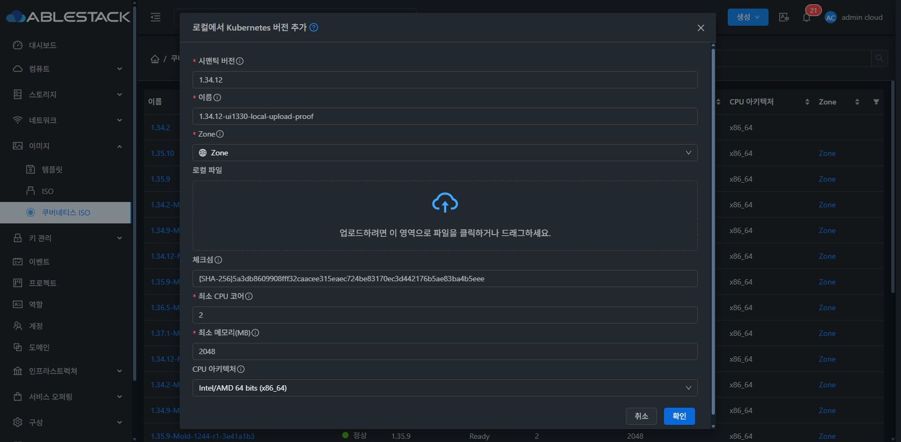

<!-- Licensed to the Apache Software Foundation (ASF) under one or more
contributor license agreements. See the NOTICE file distributed with this work
for additional information regarding copyright ownership. The ASF licenses this
file to you under the Apache License, Version 2.0 (the "License"); you may not use
this file except in compliance with the License. You may obtain a copy at
http://www.apache.org/licenses/LICENSE-2.0 . Unless required by applicable law or
agreed to in writing, software distributed under the License is distributed on
an "AS IS" BASIS, WITHOUT WARRANTIES OR CONDITIONS OF ANY KIND. See the License
for the specific language governing permissions and limitations. -->
# Europa Kubernetes UI 실제 시험 기록

대상은 #1330 및 시험 중 발견한 #1331이다. 가상머신 목록·상세 표준, 공통 네트워크 화면, 관리형/외부 관리형 생성과 생명주기를 실제 31번 Mold UI에서 검증했다. 세부 판정은 [UI-MATRIX.md](UI-MATRIX.md), 승인 설계는 [설계 문서](../../design/kubernetes-ui-unification-20261008/)를 참조한다.

## 변경과 시험 범위

- 목록은 VM 공통 표·페이지네이션·우클릭 작업을 사용한다. 상세 정보 탭은 정보만 표시하고 작업은 전역 작업 메뉴/좌측 정보 우클릭으로 제공한다. 이벤트·코멘트는 기존 공통 화면을 사용한다.
- 관리형 VM 탭은 확장을 메인, 외부 노드 추가를 보조 작업으로 표시한다. 외부 관리형은 노드 연결을 메인으로 표시하고 API가 받지 않는 생성 필드는 제출하지 않는다.
- 공통 네트워크 툴바는 왼쪽 메인 버튼 다음 업데이트, gap8px이다. PF는 프로토콜·공인 포트 pair·게스트 포트 pair·VM/NIC를 목적별로 구분한다. LB는 선택된 VM/NIC만 연결하며 무선택 시 규칙만 생성한다. 정책/대상/태그 작업과 API·Service 소유 규칙 보호를 공통 구성요소로 제공한다.
- 다크모드 안내/레이블/입력/표/버튼은 테마 토큰을 사용한다. section은 기본 글자 크기의 굵기와 선으로 구분한다. Kubernetes 아이콘은 currentColor를 따른다.
- 부하분산 업데이트는 규칙·대상·정책 조회가 끝난 한 번의 결과를 반영한다. 대기/실패에는 기존 목록을 보존하고 버튼에만 갱신 상태를 표시한다. 상세 재조회가 이미 로드된 탭/대화상자를 다시 만들지 않는다.
- 실제 UI에서 발견한 기본 KVM 제출, strict custom root 반복 초기화, 외부 관리형 번역 키, 언어 변경 시 VM 머리글 잔류, SourceBased 세션 정책 값 복원 오류도 보완했다.

## 환경 및 실제 동작 결과

31번 관리 서버와 31.1/31.2/31.3 호스트를 사용했다. Primary는 SharedMountPoint `/mnt/glue-gfs`, 실제 findmnt 결과 GFS2 `/dev/mapper/vg_glue-lv_glue`이다. 노드와 VR 모두 strict GFS2 오퍼링을 선택했으며 clvm/clvm-ng는 사용하지 않았다.

관리형 cluster70에서 생성·워커 확장/축소·AS 활성화/비활성화·정지/시작·Affinity·1.34.9→1.34.12 업그레이드·외부 워커 조인/분리·삭제를 수행했다. 각 단계는 UI/API 및 실제 Node Ready 결과로 확인했다. 최종 기본 KVM 제출 재시험 cluster75는 1.34.12로 Running, control1/worker1이 Ready이며 둘 다 root20GB GFS2 볼륨을 사용한다. Provider/CNI/DNS/Headlamp 등 13개 pod가 Running 1/1이다.

외부 등록71/73/74에서 등록·역할별 VM 연결/분리·노드 보존 삭제를 실행했다. 외부 등록 삭제는 state가 Running으로 남아 있어도 removed 타임스탬프로 판정한다. VM352의 관리형 외부 워커 시험은 #1314에 기록한 cloud-init/DHCP/SSH/sudo/swap 준비조건을 시험 VM에 보정한 후 통과했다. 준비 전 원본 이미지의 무수정 성공으로 주장하지 않는다.

제한 CIDR `10.10.21.101/32`와 별도 시험 VM의 18080 서비스로 PF18443/LB18444 실제 통신을 확인했다. FW/PF 생성·교체/편집·삭제, LB 선택 VM/NIC 생성·편집·연결 해제/재연결·태그·세션 고정 경로를 실행했다. 운영 관리 API6443·SSH 규칙은 작업 비활성화로 보호했다.

## 최종 빌드 및 배포

관련14 suites / 115 tests PASS. Node20.20.2/npm10.8.2, WSL ext4에서 production UI 모듈을 빌드한다. 명령은 `NODE_OPTIONS=--openssl-legacy-provider npm run build`이다. webpack4의 OpenSSL 호환 옵션과 bundle 크기 경고가 있으며 전체 Cloud 빌드는 실행하지 않았다.

최종 UI 패키지 `kubernetes-ui-1330-20261008-182747.tgz`의 SHA-256은 `0989d17e7186fef6cfa8335d87ffdca11d9c26f6bbee614345ae6ddceddd6c54`이다. 31번 active webapp의 정적 파일 840개 해시 일치를 확인했다. WEB-INF/config.json과 mold PID5641을 보존했고 mold active 및 `/client/` HTTP200을 확인했다. 백업은 `/root/kubernetes-ui-1330-deploy-20261008-182755/static-backup.tgz`이다. 서버 전체 디렉터리 교체와 rsync --delete는 사용하지 않았다.

최종 배포에서 부하분산 업데이트를 클릭한 직후에도 기존 2개 규칙과 대상 VM이 유지됐다. 전체 skeleton0/spinner0, 업데이트 버튼 loading1, 버튼 간격8px을 확인했고 번역 키가 화면에 노출되지 않았다. SourceBased 정책의 `10k/30m` 재열기, `20k/40m` 수정 후 재열기, 정책 제거까지 실제 UI/API로 통과했다. 다크모드 레이블·입력값·안내문을 실제 화면에서 재확인했다.

## 시험 자원 정리

관리형70/실패 등록72와 외부 등록71/73/74는 삭제 이력을 확인했다. 수동 시험 FW/PF/LB와 SourceBased 정책은 `removed` 시각으로 삭제를 검증했다. 규칙의 state가 Active/Add로 남는 삭제 이력을 활성 규칙으로 해석하지 않는다. 현재 network258의 활성 규칙은 최종 cluster75의 관리 SSH2222–2223/API6443용 5개뿐이다.

시험 VM352/356은 UI에서 영구 삭제 선택 없이 Destroyed 상태로 정리했으며 복구 가능한 삭제 상태이다. 물리 디스크 완전 제거로 판정하지 않는다. cluster75/network258 및 임시 ISO78은 아래 운영자 확인을 완료할 때까지 보존한다. 장기 시험 cluster31–36은 모두 Running, removed=NULL이며 변경하지 않았다.

## 남은 환경 확인

- 최종 cluster75의 UI kubeconfig 저장 파일은 사용자 Windows 저장 완료 확인이 필요하다. API 구성 다운로드와 해당 kubeconfig의 실제 kubectl 접근은 확인했다.
- ISO78의 GitHub URL 등록 자체는 성공했지만, 서버 `store.download.follow.redirects=false`로 HTTP302에서 다운로드가 중단된다. #1228/#1230에 명시된 운영 전제조건이며 새 중복 이슈를 만들지 않았다. 시험 중 true→완료 후 false 복구 승인을 기다린다.
- ISO 로컬 업로드는 live API 제공·아이콘 진입·1000px 폼과 필수값 검증을 확인했다. 공개 Release ISO 832,899,072bytes를 Windows 시험 PC에 내려받아 SHA-256 일치를 검증했다. Chrome 확장의 로컬 파일 권한이 꺼져 있어 사용자 파일 선택을 기다리며 실제 전송은 아직 미실행이다. 권한을 임의로 확대하지 않았다. 별도 VPC·Tungsten·SSL·LB AS 그룹 환경도 실 동작 완료로 판정하지 않는다. 일반 공통 화면의 API 조건과 단위 검증 범위에 포함된다.

## 실제 화면 증거

각 이미지는 실제 배포 Chrome 화면이며 목업이 아니다. 구성 원문/자격 증명이 보이는 캡처는 게시하지 않는다.

### 관리형 생성 및 노드 작업

### 액세스 및 네트워크

### 최종 갱신 및 세션 정책 재검증

### 상세 작업 및 공통 탭

### 좁은 화면

캡처는 해당 기능을 시험한 시점의 실제 화면이다. 최종 갱신 및 세션 정책 재검증 섹션은 마지막 패키지의 실제 배포 결과이며 로컬 ISO 이미지는 전송 완료가 아닌 파일 선택 대기 상태를 보여준다.
